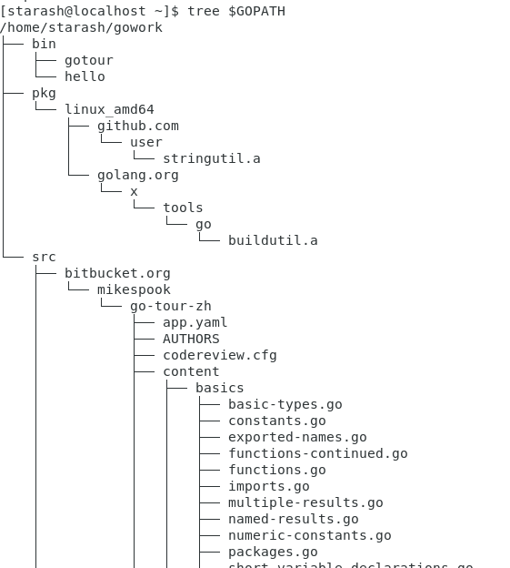
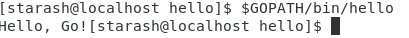

# **Go语言基础作业**  


**仔细阅读官方文档[如何使用Go编程](https://go-zh.org/doc/code.html) ，并按文档写第一个包，做第一次测试。**   
1. 工作空间与环境变量设置  
创建一个gowork文件夹  
修改profile在最后添加以下内容添加环境变量    
    ```c
    export GOPATH=$HOME/gowork
    export PATH=$PATH:$GOPATH/bin
    ```    
    输入source /etc/profile使其生效  
    整个工作空间结构如下  
      

2. 编写第一个包  
在终端输入以下指令创建reverse.go并使用vscode编写代码   
    ```  
    cd $GOPATH/src/github.com/user/stringutil  
    touch reverse.go  
    code reverse.go  
    ```  
    按照指南中填写代码  
    ```go  
    package stringutil

    func Reverse(s string) string {
        r := []rune(s)
        for i,j := 0, len(r)-1; i<len(r)/2;i,j = i+1,j-1 {
            r[i], r[j] = r[j], r[i]
        }
        return string(r)
    }
    ```  
    保存后输入```go build```即可  
    创建好包后创建hello.go执行  
    ```  
    cd $GOPATH/src/github.com/user/hello  
    touch hello.go  
    code hello.go  
    ```  
    按照指南填写代码  
    ```go
        package main

        import (
            "fmt"
            "github.com/user/stringutil"
        )

        func main()  {
            fmt.Printf(stringutil.Reverse("!oG ,olleH"))
        }
    ```  
    保存后输入```go install```  
    输入```$GOPATH/bin/hello```即可执行程序  
      
