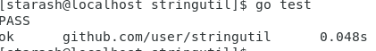

# **Go语言基础作业**  


**仔细阅读官方文档[如何使用Go编程](https://go-zh.org/doc/code.html) ，并按文档写第一个包，做第一次测试。**   
1. **工作空间与环境变量设置**  
创建一个gowork文件夹  
修改profile在最后添加以下内容添加环境变量    
    ```c
    export GOPATH=$HOME/gowork
    export PATH=$PATH:$GOPATH/bin
    ```    
    输入source /etc/profile使其生效  
    整个工作空间结构如下  
      

2. **编写第一个包**  
在终端输入以下指令创建reverse.go并使用vscode编写代码   
    ```  
    cd $GOPATH/src/github.com/user/stringutil  
    touch reverse.go  
    code reverse.go  
    ```  
    按照指南中填写代码  
    ```go  
    package stringutil

    func Reverse(s string) string {
        r := []rune(s)
        for i,j := 0, len(r)-1; i<len(r)/2;i,j = i+1,j-1 {
            r[i], r[j] = r[j], r[i]
        }
        return string(r)
    }
    ```  
    保存后输入```go build```即可  
    创建好包后创建hello.go    
    ```  
    cd $GOPATH/src/github.com/user/hello  
    touch hello.go  
    code hello.go  
    ```  
    按照指南填写代码  
    ```go
        package main

        import (
            "fmt"
            "github.com/user/stringutil"
        )

        func main()  {
            fmt.Printf(stringutil.Reverse("!oG ,olleH"))
        }
    ```  
    保存后输入```go install```  
    输入```$GOPATH/bin/hello```即可执行程序  
      
    随便创建一个文件夹，将其初始化为仓库，将远程仓库通过git clone拉下来.  
    ```
    mkdir ServiceComputing
    git clone https://github.com/StarashZero/ServerComputing.git  
    ```  
    将代码文件复制到相应位置  
    ```
    cp $GOPATH/src/github.com/user/hello/hello.go ServerComputing/hw2/code  
    cp $GOPATH/src/github.com/user/stringutil/reverse.go ServerComputing/hw2/code  
    ```  
    进入clone仓库中，将新文件add和commit，然后push，就可以将代码上传至远程仓库了  
    ```
    git add .
    git commit -m "code"  
    git push  
    ```    

3. **测试**  
    创建reverse_test.go文件  
    ```  
    cd $GOPATH/src/github.com/user/stringutil  
    touch reverse_test.go  
    code reverse_test.go  
    ```  
    按照指南编写代码  
    ```go
    package stringutil

    import "testing"

    func TestReverse(t *testing.T)  {
        cases := []struct{
            in, want string
        } {
            {"Hello, world", "dlrow ,olleH"},
            {"Hello, 世界", "界世 ,olleH"},
            {"", ""},
        }
        for _, c:=range cases {
            got := Reverse(c.in)
            if got != c.want {
                t.Errorf("Reverse(%q) == %q, want %q", c.in, got, c.want)
            }
        }
    }
    ```  
    输入```go test```进行测试  
      
    用同样的方式将其推入远程仓库  
    ```
    cd ~/Desktop/ServiceComputing/ServerComputing
    cp $GOPATH/src/github.com/user/stringutil/reverse_test.go hw2/code
    git add .
    git commit "code"
    git push
    ```