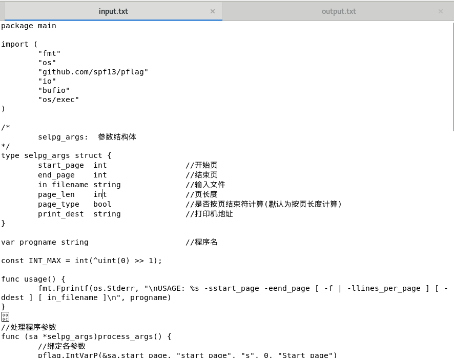
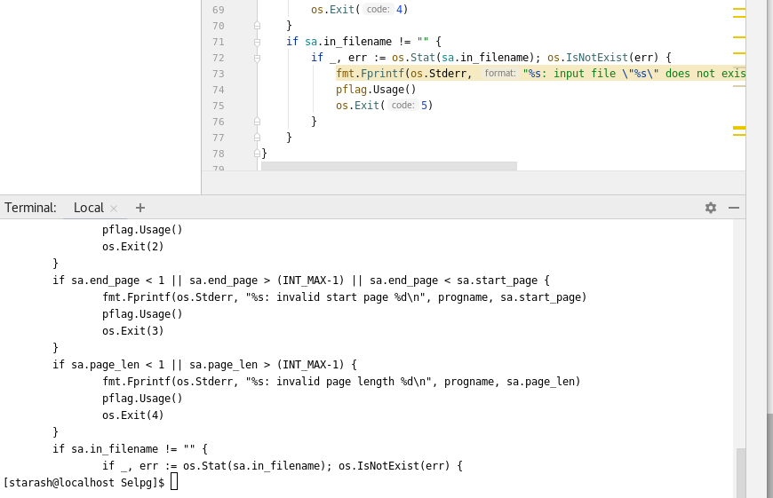
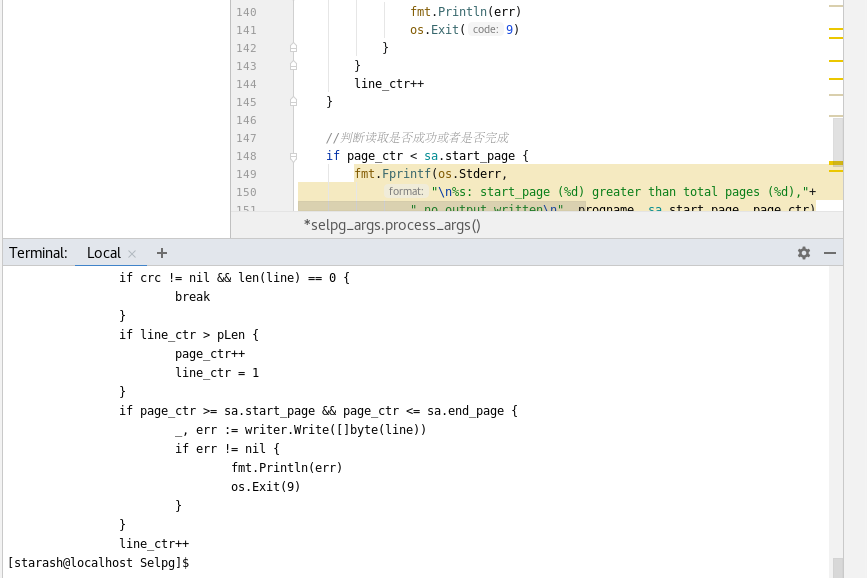
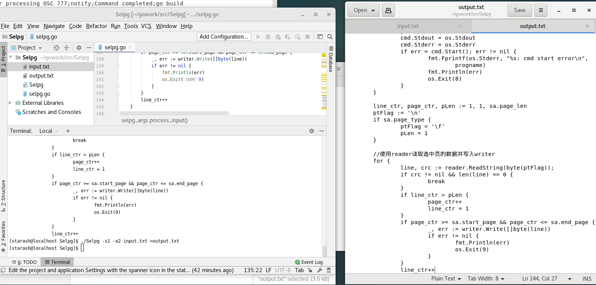
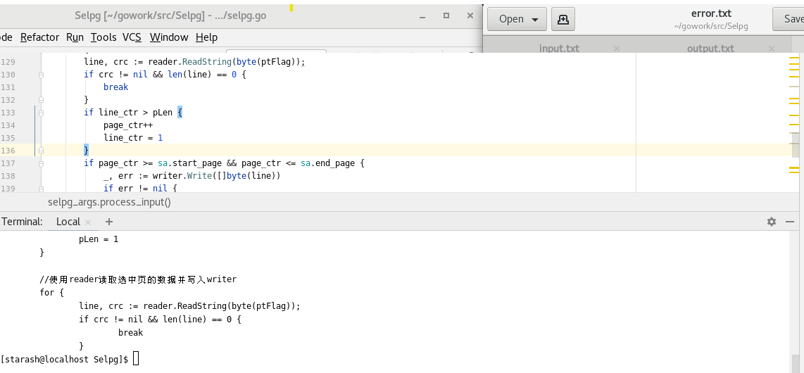
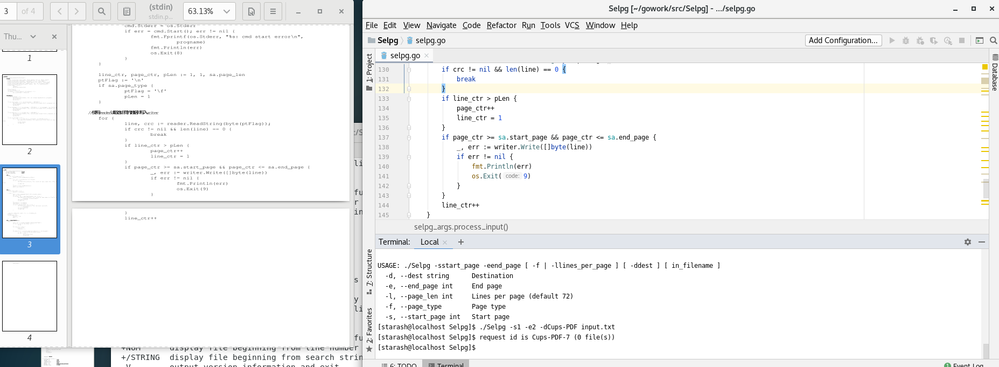

# **CLI 命令行实用程序开发基础**  
## **前言**
这是中山大学数据科学与计算机学院2019年服务计算的作业项目。所有代码与博客将被上传至github当中。  
Go-Online项目地址: [http://139.9.57.167:20080/share/bmcbs3u76kvpt2sh99pg?secret=false](http://139.9.57.167:20080/share/bmcbs3u76kvpt2sh99pg?secret=false)  
Github项目地址: [https://github.com/StarashZero/ServerComputing/tree/master/hw3](https://github.com/StarashZero/ServerComputing/tree/master/hw3)  
个人主页: [https://starashzero.github.io](https://starashzero.github.io)   
实验要求: [https://pmlpml.github.io/ServiceComputingOnCloud/ex-cli-basic](https://pmlpml.github.io/ServiceComputingOnCloud/ex-cli-basic)  
## **1、**概述****
  CLI（Command Line Interface）实用程序是Linux下应用开发的基础。正确的编写命令行程序让应用与操作系统融为一体，通过shell或script使得应用获得最大的灵活性与开发效率。Linux提供了cat、ls、copy等命令与操作系统交互；go语言提供一组实用程序完成从编码、编译、库管理、产品发布全过程支持；容器服务如docker、k8s提供了大量实用程序支撑云服务的开发、部署、监控、访问等管理任务；git、npm等都是大家比较熟悉的工具。尽管操作系统与应用系统服务可视化、图形化，但在开发领域，CLI在编程、调试、运维、管理中提供了图形化程序不可替代的灵活性与效率  

## **2、项目要求**  
使用 golang开发[开发 Linux 命令行实用程序](https://www.ibm.com/developerworks/cn/linux/shell/clutil/index.html) 中的selpg
  
提示：  
  
* 请按文档 使用 selpg 章节要求测试你的程序  
* 请使用 pflag 替代 goflag 以满足 Unix 命令行规范， 参考：[Golang之使用Flag和Pflag](https://o-my-chenjian.com/2017/09/20/Using-Flag-And-Pflag-With-Golang/)
* golang 文件读写、读环境变量，请自己查 os 包
* “-dXXX” 实现，请自己查 os/exec 库，例如案例 [Command](https://godoc.org/os/exec#example-Command)，管理子进程的标准输入和输出通常使用 io.Pipe，具体案例见 [Pipe](https://godoc.org/io#Pipe)  

## **3、程序思路**  
selpg 是从文本输入选择页范围的实用程序，其主要步骤就是读取用户参数、处理用户参数、读取输入、将选中页数据送入输出地址。    
在[开发 Linux 命令行实用程序](https://www.ibm.com/developerworks/cn/linux/shell/clutil/index.html)中提供了[slepg.c](https://www.ibm.com/developerworks/cn/linux/shell/clutil/selpg.c)的源代码，因此这次更多的算是一次翻译任务，只是需要注意一些c与go不同的地方。  
因此这次代码编写更适合当做一次go语言练习，适合用来练习go语言一些与其他语言习惯不同的特性，例如结构体、方法等。 

## **4、代码实现**  
* **参数结构体selpg_args:**  
    基本与selpg.c一致，不同在于page_type变成了bool类型，主要是方便使用pflag绑定参数  
    ```go
    /*
	selpg_args:  参数结构体
    */
    type selpg_args struct {
        start_page  int			//开始页
        end_page    int			//结束页
        in_filename string		//输入文件
        page_len    int			//页长度
        page_type   bool		//是否按页结束符计算(默认为按页长度计算)
        print_dest  string		//打印机地址
    }
    ```  
* **命令格式(给用户的提示):**  
    函数usage会输出selpg命令的格式，当用户输入有误时可以作为提示使用。  
    ```go  
    func usage() {
        fmt.Fprintf(os.Stderr, "\nUSAGE: %s -sstart_page -eend_page [ -f | -llines_per_page ] [ -ddest ] [ in_filename ]\n", progname)
    }
    ```
* **绑定参数:**  
    绑定参数可以很方便地使用pflag包，pflag包的安装与使用方法在提示里。  
    ```go 
    //绑定各参数
	pflag.IntVarP(&sa.start_page, "start_page", "s", 0, "Start page")
	pflag.IntVarP(&sa.end_page, "end_page", "e", 0, "End page")
	pflag.BoolVarP(&sa.page_type, "page_type", "f", false, "Page type")
	pflag.IntVarP(&sa.page_len, "page_len", "l", 72, "Lines per page")
	pflag.StringVarP(&sa.print_dest, "dest", "d", "", "Destination")
	pflag.Usage = func() {
		usage()
		pflag.PrintDefaults()
	}
	pflag.Parse()
	sa.in_filename = ""
	if remain := pflag.Args(); len(remain) > 0 {
		sa.in_filename = remain[0]
	}
    ```  
* **参数合法性检测:**  
    通过pflag获得各参数后，还需要判断用户输入的参数是否有效合法。根据自己的理解并结合pflag的特性删除了部分条件判断。  
    ```go
    //判断各参数是否合法
	if len(os.Args) < 3 {
		fmt.Fprintf(os.Stderr, "%s: not enough arguments\n", progname)
		pflag.Usage()
		os.Exit(1)
	}
	if sa.start_page < 1 || sa.start_page > (INT_MAX-1) {
		fmt.Fprintf(os.Stderr, "%s: invalid start page %d\n", progname, sa.start_page)
		pflag.Usage()
		os.Exit(2)
	}
	if sa.end_page < 1 || sa.end_page > (INT_MAX-1) || sa.end_page < sa.start_page {
		fmt.Fprintf(os.Stderr, "%s: invalid start page %d\n", progname, sa.start_page)
		pflag.Usage()
		os.Exit(3)
	}
	if sa.page_len < 1 || sa.page_len > (INT_MAX-1) {
		fmt.Fprintf(os.Stderr, "%s: invalid page length %d\n", progname, sa.page_len)
		pflag.Usage()
		os.Exit(4)
	}
	if sa.in_filename != "" {
		if _, err := os.Stat(sa.in_filename); os.IsNotExist(err) {
			fmt.Fprintf(os.Stderr, "%s: input file \"%s\" does not exist\n", progname, sa.in_filename)
			pflag.Usage()
			os.Exit(5)
		}
	}
    ```  
* **输入输出接收器:**    
    读取输入需要用到bufio包，输出则使用io.WriteCloser
    ```go
    var reader *bufio.Reader		//输入读取
    var writer io.WriteCloser		//输出写入
    ```   
* **获得reader:**  
    若用户输入了in_filename，则将文件作为输入，否则将命令行作为输入  
    ```go
    //获得reader
	if sa.in_filename == "" {
		reader = bufio.NewReader(os.Stdin)
	} else {
		fin, err := os.Open(sa.in_filename)
		if err != nil {
			fmt.Fprintf(os.Stderr, "%s: could not open input file \"%s\"\n", progname, sa.in_filename)
			os.Exit(6)
		}
		reader = bufio.NewReader(fin)
		defer fin.Close()
	}
    ```  
* **获得writer:**  
    若参数中包含-dXXX则使用lp -dXXX指令将输入送入指定打印机，否则将输入输出在命令行上。  
    执行lp指令需要借助exec包，用法在提示中有。  
    ```go
    //获得writer
	if sa.print_dest == "" {
		writer = os.Stdout
	} else {
		cmd := exec.Command("lp","-d"+ sa.print_dest)
		var err error
		if writer, err = cmd.StdinPipe(); err != nil {
			fmt.Fprintf(os.Stderr, "%s: could not open pipe to \"%s\"\n",
				progname, sa.print_dest)
			fmt.Println(err)
			os.Exit(7)
		}
		cmd.Stdout = os.Stdout
		cmd.Stderr = os.Stderr
		if err = cmd.Start(); err != nil {
			fmt.Fprintf(os.Stderr, "%s: cmd start error\n",
				progname)
			fmt.Println(err)
			os.Exit(8)
		}
	}
    ```  
* **将输入送入输出:**  
    通过遍历读取的方式，将指定页范围的数据送入输出地址  
    若用户使用了-f参数，则将'\f'作为页结束符，一个'\f'算一页，否则page_len行作为一页。  
    ```go
    line_ctr, page_ctr, pLen := 1, 1, sa.page_len
	ptFlag := '\n'
	if sa.page_type {
		ptFlag = '\f'
		pLen = 1
	}

	//使用reader读取选中页的数据并写入writer
	for {
		line, crc := reader.ReadString(byte(ptFlag));
		if crc != nil && len(line) == 0 {
			break
		}
		if line_ctr > pLen {
			page_ctr+
			line_ctr = 1
		}
		if page_ctr >= sa.start_page && page_ctr <= sa.end_page {
			_, err := writer.Write([]byte(line))
			if err != nil {
				fmt.Println(err)
				os.Exit(9)
			}
		}
		line_ctr++
	}
    ```  
* **判断程序执行是否成功或完成:**  
    若page_ctr < sa.start_page, 说明sa.start_page超过了输入文件的页总和，则程序执行失败(没有输出)。  
    若page_ctr < sa.end_page, 说明sa.end_page超过了输入文件的页总和，说明程序执行不完全(可能提前因为到达文件结尾EOF中止了)。
    ```go  
    //判断读取是否成功或者是否完成
	if page_ctr < sa.start_page {
		fmt.Fprintf(os.Stderr,
			"\n%s: start_page (%d) greater than total pages (%d),"+
				" no output written\n", progname, sa.start_page, page_ctr)
	} else if page_ctr < sa.end_page {
		fmt.Fprintf(os.Stderr, "\n%s: end_page (%d) greater than total pages (%d),"+
			" less output than expected\n", progname, sa.end_page, page_ctr)
	}
    ```  
* **主函数:**    
    只需要简单初始化再调用定义好的程序即可，将函数作为selp_args的方法主要是我想练习一下go语言面向对象的写法。  
    ```go
    func main() {
        sa := selpg_args{}
        progname = os.Args[0]
        sa.process_args()
        sa.process_input()
    }
    ```  
## **5. 程序测试**  
* **测试环境**  
    在Centos上进行测试，IDE使用的是Goland(习惯了Intelij全家桶就没用VSC了)  
* **输入文件**  
    为了方便，我直接将代码作为输入文件的内容了，并往其中加了三个分页符，代码160行左右，因此按72行一页来算是3页，按分页符来算是4页(最后一页我没加)。  
     
* ```./Selpg -s1 -e1 input.txt```    
    该指令会将第一页的内容输出到屏幕上，可以看到屏幕最后一行对应代码的第72行(默认一页的长度)。  
        
* ```./Selpg -s1 -e1 < input.txt```  
    该指令效果与上一指令相同  
      
* ```more input.txt | ./Selpg -s1 -e2```  
    文件实在没有10行20行这么多，只好除以10了  
    该指令将more指令的输出，可以看到    可以看到屏幕最后一行对应代码的第144行。  
      
* ```./Selpg -s1 -e2 input.txt >output.txt```  
    该指令会将input.txt的1-2页输入到output.txt中  
      
* ```./Selpg -s10 -e20 input.txt 2>error.txt```  
    由于总共只有3页，10>3，因此error.txt中会出现报错信息
      
* ```./Selpg -s1 -e4 input.txt >output.txt 2>error.txt```  
    上面两条指令结合，output.txt会有1-3页，而error.txt中报错  
      
    中间还有一些测试指令，大多与shell性质有关，且和上面重复很多，因此就不展示了。    
* ```./Selpg -s1 -e2 -l66 input.txt```  
    通过-l指定每一页的行数，能看到最后一行是代码的第132行  
      
* ```./Selpg -s1 -e2 -f input.txt```  
    通过-f表示每一页以'\f'为标志，能看到最后一行是input.txt中第二个'\f'的位置  
      
* ```./Selpg -s1 -e2 -dCups-PDF input.txt```
    通过-d将输出送入打印机，这里用模拟打印机Cups-PDF,可以看到被打印至代码的第144行  
      

至此所有功能测试完毕，程序完成。
