# **CLI 命令行实用程序开发实战 - Agenda**

## **导航**  
* [前言](#1)
* [概述](#2)
* [项目要求](#3)
* [项目结构与思路](#4)
* [代码解释与测试](#5)
    * [myAgenda](#5.1)
        * [Date](#5.1.1)
        * [User](#5.1.2)
        * [Meeting](#5.1.3)
        * [Storage](#5.1.4)
    * [cmd](#5.2)
        * [用户注册: register](#5.2.1)
        * [用户登录: logIn](#5.2.2)
        * [用户登出: logOut](#5.2.3)
        * [用户删除: cancel](#5.2.4)
        * [用户查询: listUsers](#5.2.5)
        * [创建会议: createMeeting](#5.2.6)
        * [增加会议参与者: addMeetingParticipator](#5.2.7) 
        * [查询会议: meetingQuery](#5.2.8)  
        * [删除会议参与者: removeMeetingParticipator](#5.2.9)
        * [退出会议: quitMeeting](#5.2.10)
        * [取消会议: deleteMeeting](#5.2.11)
        * [清空会议: deleteAllMeeting](#5.2.12)

## **<div id="1">前言</div>**
这是中山大学数据科学与计算机学院2019年服务计算的作业项目。所有代码与博客将被上传至Go-Online与github当中。(Go-Online与github上代码在路径略有差异，主要是Go-Online上不能按相对路径来导入本地packege)    
Go-Online项目地址: [http://www.go-online.org.cn:8080/share/bmrc08e76kvn1rs2tr20?secret=false](http://www.go-online.org.cn:8080/share/bmrc08e76kvn1rs2tr20?secret=false)  
Github项目地址: [https://github.com/StarashZero/ServerComputing/tree/master/hw4](https://github.com/StarashZero/ServerComputing/tree/master/hw4)  
个人主页: [https://starashzero.github.io](https://starashzero.github.io)   
实验要求: [https://pmlpml.github.io/ServiceComputingOnCloud/ex-cli-agenda](https://pmlpml.github.io/ServiceComputingOnCloud/ex-cli-agenda)  

## **<div id="2">概述</div>**  
命令行实用程序并不是都象 cat、more、grep 是简单命令。go 项目管理程序，类似 java 项目管理 maven、Nodejs 项目管理程序 npm、git 命令行客户端、 docker 与 kubernetes 容器管理工具等等都是采用了较复杂的命令行。即一个实用程序同时支持多个子命令，每个子命令有各自独立的参数，命令之间可能存在共享的代码或逻辑，同时随着产品的发展，这些命令可能发生功能变化、添加新命令等。因此，符合 OCP 原则 的设计是至关重要的编程需求。  

## **<div id="3">项目要求</div>**  
**<center>(老师课程要求至少实现两个命令，由于时间比较充足，所以我就全实现了)</center>**  
**用户注册**

1.	注册新用户时，用户需设置一个唯一的用户名和一个密码。另外，还需登记邮箱及电话信息。
2.	如果注册时提供的用户名已由其他用户使用，应反馈一个适当的出错信息；成功注册后，亦应反馈一个成功注册的信息。

**用户登录**

1.	用户使用用户名和密码登录 Agenda 系统。
2.	用户名和密码同时正确则登录成功并反馈一个成功登录的信息。否则，登录失败并反馈一个失败登录的信息。

**用户登出**

1. 已登录的用户登出系统后，只能使用用户注册和用户登录功能。

**用户查询**

1. 已登录的用户可以查看已注册的所有用户的用户名、邮箱及电话信息。

**用户删除**

1.	已登录的用户可以删除本用户账户（即销号）。
2.	操作成功，需反馈一个成功注销的信息；否则，反馈一个失败注销的信息。
3.	删除成功则退出系统登录状态。删除后，该用户账户不再存在。
4.	用户账户删除以后：
    *	以该用户为 发起者 的会议将被删除
    *	以该用户为 参与者 的会议将从 参与者 列表中移除该用户。若因此造成会议 参与者 人数为0，则会议也将被删除。

**创建会议**

1.	已登录的用户可以添加一个新会议到其议程安排中。会议可以在多个已注册
用户间举行，不允许包含未注册用户。添加会议时提供的信息应包括：
    * 会议主题(title)（在会议列表中具有唯一性）
    *	会议参与者(participator)
    *	会议起始时间(start time)
    * 会议结束时间(end time)
2.	注意，任何用户都无法分身参加多个会议。如果用户已有的会议安排（作为发起者或参与者）与将要创建的会议在时间上重叠 （允许仅有端点重叠的情况），则无法创建该会议。
3.	用户应获得适当的反馈信息，以便得知是成功地创建了新会议，还是在创建过程中出现了某些错误。

**增删会议参与者**

1.	已登录的用户可以向 自己发起的某一会议增加/删除 参与者 。
2.	增加参与者时需要做 时间重叠 判断（允许仅有端点重叠的情况）。
3.	删除会议参与者后，若因此造成会议 参与者 人数为0，则会议也将被删除。

**查询会议**

1.	已登录的用户可以查询自己的议程在某一时间段(time interval)内的所有会议安排。
2.	用户给出所关注时间段的起始时间和终止时间，返回该用户议程中在指定时间范围内找到的所有会议安排的列表。
3.	在列表中给出每一会议的起始时间、终止时间、主题、以及发起者和参与者。
4.	注意，查询会议的结果应包括用户作为 发起者或参与者 的会议。

**取消会议**

1.	已登录的用户可以取消 自己发起 的某一会议安排。
2.	取消会议时，需提供唯一标识：会议主题（title）。

**退出会议**

1.	已登录的用户可以退出 自己参与 的某一会议安排。
2.	退出会议时，需提供一个唯一标识：会议主题（title）。若因此造成会议 参与者 人数为0，则会议也将被删除。

**清空会议**

1. 已登录的用户可以清空 自己发起 的所有会议安排。  

## **<div id="4">项目结构与思路</div>**  
* 项目结构:  
    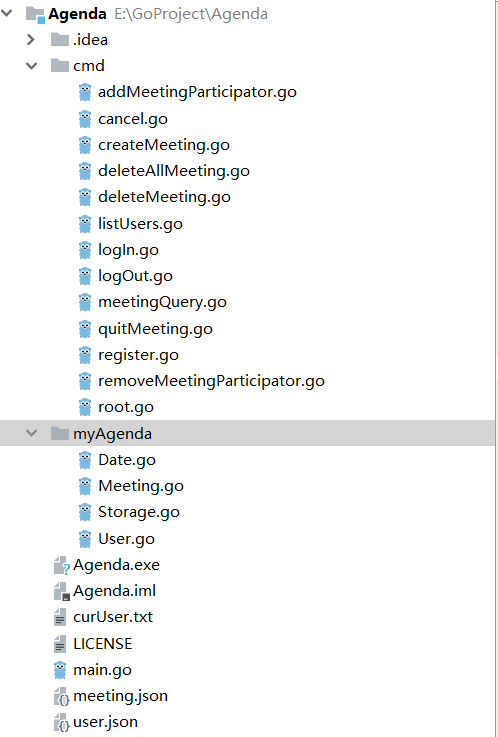  
    GoOnline截不下来全部结构，所以用的IDEA的截图。  
    myAgenda中存放```User```和```Meeting```对象读写与处理逻辑  
    cmd中存放命令实现代码  
* 程序思路:  
    由于以前使用c++实现过了Agenda，因此这次更多的还是代码翻译，结合go语言的特性进行优化。  

## **<div id="5">代码解释与测试</div>**  
由于工作量较多，时间比较紧促，所以不一定能测试到所有方面，程序可能存在未发现的Bug。  
### **<div id="5.1">myAgenda</div>**  
myAgenda中存放```User```和```Meeting```对象读写与处理逻辑，包括Date、Meeting、Storage、User四个文件，所有的成员都是公开的，省去get、set的编写以减少工作量。  
* **<div id="5.1.1">Date</div>**  
    Date包装程序需要使用的时期信息，并提供一些功能函数  
    包含的数据有年、月、日、时、分  
    ```go  
    type Date struct {
        M_year   int
        M_month  int
        M_day    int
        M_hour   int
        M_minute int
    }
    ```  
    需要对用户输入的时期进行检验，判断其是否合法，因此Date文件包含一个判断时期合法的函数IsValid  
    ```go
    //判断一个Date结构体数据是否合法
    var date = []int{31, 28, 31, 30, 31, 30, 31, 31, 30, 31, 30, 31};

    func isleap(year int) bool {
        if year%4 == 0 {
            if year%400 != 0 && year%100 == 0 {
                return false
            }
            return true
        }
        return false
    }
    func IsValid(t_date Date) bool {
        judge := true
        if isleap(t_date.M_year) {
            date[1] = 29
        } else {
            date[1] = 28
        }
        if t_date.M_year > 9999 || t_date.M_year < 1000 {
            judge = false
        } else if t_date.M_month > 12 || t_date.M_month < 1 {
            judge = false
        } else if t_date.M_day > date[t_date.M_month-1] || t_date.M_day < 1 {
            judge = false
        } else if t_date.M_hour > 23 || t_date.M_hour < 0 {
            judge = false
        } else if t_date.M_minute > 59 || t_date.M_minute < 0 {
            judge = false
        }
        return judge
    }
    ```  
    在判断查询Meeting与创建Meeting时需要对时期进行比较，因此Date提供一个比较函数CompareDate  
    ```go  
    func CompareDate(date1, date2 Date) int {
        if date1.M_year < date2.M_year {
            return -1
        } else if date1.M_year > date2.M_year {
            return 1
        }

        if date1.M_month < date2.M_month {
            return -1
        } else if date1.M_month > date2.M_month {
            return 1
        }

        if date1.M_day < date2.M_day {
            return -1
        } else if date1.M_day > date2.M_day {
            return 1
        }

        if date1.M_hour < date2.M_hour {
            return -1
        } else if date1.M_hour > date2.M_hour {
            return 1
        }

        if date1.M_minute < date2.M_minute {
            return -1
        } else if date1.M_minute > date2.M_minute {
            return 1
        }

        return 0
    }
    ```
    从用户接收的时期参数是以字符串形式存在，因此Date提供一个将string转为Date结构体的函数StringToDate(格式为yyyy-mm-dd/hh:mm)  
    ```go 
    //从string转为Date
    func StringToDate(str string) Date {
        var d Date
        fmt.Sscanf(str, "%d-%d-%d/%d:%d", &d.M_year, &d.M_month, &d.M_day, &d.M_hour, &d.M_minute)
        return d
    }
    ```  
    同理，查询Meeting时需要将时期转变为字符串，因此Date提供一个将Date结构体转变为string的函数DateToString(格式为yyyy-mm-dd/hh:mm)  
    ```go  
    //从Date转为string
    func (d *Date) DateToString() string {
        var str string
        str = fmt.Sprintf("%04d-%02d-%02d/%02d:%02d", d.M_year, d.M_month, d.M_day, d.M_hour, d.M_minute)
        return str
    }
    ```  
* **<div id="5.1.2">User</div>**  
    User包装用户的信息，包含的数据有用户名、密码、邮箱、手机号  
    ```go
    //User包装用户信息
    type User struct {
        M_name     string
        M_password string
        M_email    string
        M_phone    string
    }
    ```  
* **<div id="5.1.3">Meeting</div>**  
    Meeting包装会议的信息，并提供一些功能函数  
    包含的数据有标题、主持人、参与者、开始时间、结束时间  
    ```go  
    //Meeting包装会议数据
    type Meeting struct {
        M_sponsor string
        M_participators []string
        M_startDate Date
        M_endDate Date
        M_title string
    }
    ```  
    需要对Meeting的参与者进行增加和删除，因此Meeting提供了AddParticipator与RemoveParticipator两个函数  
    ```go  
    //删除一个参与者
    func (m *Meeting)RemoveParticipator(t_participator string)  {
        for element := 0; element< len(m.M_participators);element++{
            if m.M_participators[element] == t_participator{
                m.M_participators = append(m.M_participators[0:element], m.M_participators[element+1:len(m.M_participators)]...)
                break
            }
        }
    }

    //添加一个参与者
    func (m *Meeting)AddParticipator(t_participator string)  {
        m.M_participators = append(m.M_participators, t_participator)
    }
    ```  
    需要判断一个用户是否为参与者，因此Meeting提供了IsParticipator函数  
    ```go  
    //判断参与者是否在会议中
    func (m Meeting)IsParticipator(t_participator string) bool {
        for element := 0; element< len(m.M_participators);element++{
            if m.M_participators[element] == t_participator{
                return true
            }
        }
        return false
    }
    ```  
* **<div id="5.1.4">Storage</div>**  
    Storage存储程序所需的一切信息，并提供增删、查询、修改、文件读写等操作  
    包含的数据有用户列表、会议列表、登录用户列表。  
    ```go
    //Storage存储用户与会议数据
    type Storage struct {
        m_userList    list.List
        m_meetingList list.List
        m_curUserList list.List
    }
    ```  
    需要从文件中读取三个列表的数据，因此Storage提供ReadFromFile函数，对用户列表与会议列表以json形式读取，对登录用户列表以text形式读取  
    ```go  
    //从文件中读取数据
    func (s *Storage) ReadFormFile() bool {
        userFin, uErr := os.OpenFile("user.json", os.O_CREATE, 0666)
        if uErr != nil {
            fmt.Fprintf(os.Stderr, "could not open user file\n")
            return false
        }
        defer userFin.Close()
        userReader := bufio.NewReader(userFin)

        for {
            line, crc := userReader.ReadString('\n')
            if crc != nil && len(line) == 0 {
                break
            }
            var user User
            var jsonData []byte
            fmt.Sscanf(line, "%s\n", &jsonData)
            json.Unmarshal(jsonData, &user)
            s.m_userList.PushBack(user)
        }

        meetingFin, mErr := os.OpenFile("meeting.json", os.O_CREATE, 0666)
        if mErr != nil {
            fmt.Fprintf(os.Stderr, "could not open meeting file\n")
            return false
        }
        defer meetingFin.Close()
        meetingReader := bufio.NewReader(meetingFin)

        for {
            line, crc := meetingReader.ReadString('\n')
            if crc != nil && len(line) == 0 {
                break
            }
            var meeting Meeting
            var jsonData []byte
            fmt.Sscanf(line, "%s\n", &jsonData)
            json.Unmarshal(jsonData, &meeting)
            s.m_meetingList.PushBack(meeting)
        }

        curFin, cErr := os.OpenFile("curUser.txt", os.O_CREATE, 0666)
        if cErr != nil {
            fmt.Fprintf(os.Stderr, "could not open curUser file\n")
            return false
        }
        defer curFin.Close()
        curReader := bufio.NewReader(curFin)

        for {
            line, crc := curReader.ReadString('\n')
            if crc != nil && len(line) == 0 {
                break
            }
            var username string
            fmt.Sscanf(line, "%s\n", &username)
            s.m_curUserList.PushBack(username)
        }
        return true
    }
    ```  
    需要将三个列表写回文件中，因此Storage提供WriteToFile函数，对用户列表与会议列表以json形式读取，对登录用户列表以text形式读取  
    ```go  
    //将数据写入文件
    func (s *Storage) WriteToFile() bool {
        userFout, uErr := os.Create("user.json")
        if uErr != nil {
            fmt.Fprintf(os.Stderr, "could not open user file\n")
            return false
        }
        defer userFout.Close()

        for {
            if s.m_userList.Len() == 0 {
                break
            }
            element := s.m_userList.Front()
            user := element.Value.(User)
            jsonData, jErr := json.Marshal(user)
            if jErr != nil {
                panic(jErr)
            }
            fmt.Fprintf(userFout, "%s\n", jsonData)
            s.m_userList.Remove(element)
        }

        meetingFout, mErr := os.Create("meeting.json")
        if mErr != nil {
            fmt.Fprintf(os.Stderr, "could not open meeting file\n")
            return false
        }
        defer meetingFout.Close()

        for {
            if s.m_meetingList.Len() == 0 {
                break
            }
            element := s.m_meetingList.Front()
            meeting := element.Value.(Meeting)
            jsonData, jErr := json.Marshal(meeting)
            if jErr != nil {
                panic(jErr)
            }
            fmt.Fprintf(meetingFout, "%s\n", jsonData)
            s.m_meetingList.Remove(element)
        }

        curFout, cErr := os.Create("curUser.txt")
        if cErr != nil {
            fmt.Fprintf(os.Stderr, "could not open curUser file\n")
            return false
        }
        defer curFout.Close()

        for {
            if s.m_curUserList.Len() == 0 {
                break
            }
            element := s.m_curUserList.Front()
            user := element.Value.(string)
            fmt.Fprintf(curFout, "%s\n", user)
            s.m_curUserList.Remove(element)
        }
        return true
    }
    ```  
    需要对用户进行增删、查询操作，因此Storage提供CreateUser、DeleteUser、QueryUser三个函数，其中QueryUser需要提供一个选择函数filter作为参数  
    ```go  
    //创建用户
    func (s *Storage) CreateUser(u User) {
        s.m_userList.PushBack(u)
    }  
    //删除用户
    func (s *Storage) DeleteUser(u User) {
        for i := s.m_userList.Front(); i != nil; i = i.Next() {
            user := i.Value.(User)
            if user.M_name == u.M_name {
                s.m_userList.Remove(i)
                break
            }
        }
    }  
    //查询用户
    func (s *Storage) QueryUser(filter func(User) bool) list.List {
        var res list.List
        for i := s.m_userList.Front(); i != nil; i = i.Next() {
            user := i.Value.(User)
            if filter(user) {
                res.PushBack(user)
            }
        }
        return res
    }
    ```  
    需要对登录用户进行增删、查询操作，因此Storage提供CreateCurUser、DeleteCurUser、QueryCurUser三个函数，其中QueryCurUser需要提供一个选择函数filter作为参数   
    ```go  
    //创建登录用户
    func (s *Storage) CreateCurUser(username string) {
        s.m_curUserList.PushBack(username)
    }  
    //删除登录用户
    func (s *Storage) DeleteCurUser(username string) {
        for i := s.m_curUserList.Front(); i != nil; i = i.Next() {
            user := i.Value.(string)
            if username == user {
                s.m_curUserList.Remove(i)
                break
            }
        }
    }  
    //查询登录用户
    func (s *Storage) QueryCurUser(filter func(string) bool) list.List {
        var res list.List
        for i := s.m_curUserList.Front(); i != nil; i = i.Next() {
            user := i.Value.(string)
            if filter(user) {
                res.PushBack(i.Value.(string))
            }
        }
        return res
    }
    ```  
    需要对会议进行增删、查询、修改操作，因此Storage提供CreateMeeting、DeleteMeeting、QueryMeeting、UpdateMeeting四个个函数，其中QueryCurUser需要提供一个选择函数filter作为参数，UpdateMeeting需要提供一个一个选择函数filter和一个修改函数switcher作为参数  
    ```go  
    //创建会议
    func (s *Storage) CreateMeeting(m Meeting) {
        s.m_meetingList.PushBack(m)
    }

    //查询会议
    func (s *Storage) QueryMeeting(filter func(Meeting) bool) list.List {
        var res list.List
        for i := s.m_meetingList.Front(); i != nil; i = i.Next() {
            meeting := i.Value.(Meeting)
            if filter(meeting) {
                res.PushBack(meeting)
            }
        }
        return res
    }

    //更新会议
    func (s *Storage) UpdateMeeting(filter func(Meeting) bool, switcher func(*Meeting)) int {
        count := 0
        for i := s.m_meetingList.Front(); i != nil; i = i.Next() {
            meeting := i.Value.(Meeting)
            if filter(meeting) {
                switcher(&meeting)
                i.Value = meeting
                count++
            }
        }
        return count
    }

    //删除会议
    func (s *Storage) DeleteMeeting(filter func(Meeting) bool) int {
        count := 0
        for i := s.m_meetingList.Front(); i != nil; {
            meeting := i.Value.(Meeting)
            if filter(meeting) {
                j := i
                i = i.Next()
                s.m_meetingList.Remove(j)
                count++
            } else {
                i = i.Next()
            }
        }
        return count
    }
    ```   
### **<div id="5.2">cmd</div>**  
cmd中存放命令实现代码，作为用户使用程序的接口，包括了要求中的所有需求。  
* **<div id="5.2.1">用户注册: register</div>**  
    register进行用户注册  
    + 用户需要提供四个参数: 用户名、密码、邮箱、手机号    
        ```go  
        registerCmd.Flags().StringP("username", "u", "username", "Username")
        registerCmd.Flags().StringP("password", "p", "password", "Password")
        registerCmd.Flags().StringP("email", "e", "email@123.com", "Email")
        registerCmd.Flags().StringP("phone", "t", "123456789", "Phone")
        ```  
    + 获得参数后首先需要判断需要注册的用户是否已存在(用户名唯一)，使用Storage提供的QueryUser进行查询，若用户已存在，则返回报错信息  
        ```go
        valid := s.QueryUser(func(user myAgenda.User) bool {
            return user.M_name == username
        })
        if valid.Len()!=0{
            fmt.Fprintf(os.Stderr, "Register fail!: User exited!\n")
            return
        }
        ```  
    + 若用户名不存在，则进行注册，使用Storage提供的CreateUser与WriteToFile保存信息，并输出正确信息  
        ```go
        s.CreateUser(myAgenda.User{
            username,
            password,
            email,
            phone,
        })
        s.WriteToFile()
        fmt.Println("Register successed")
        ```  
    + 测试:   
        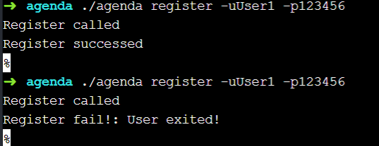  
        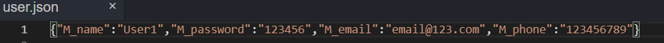  
* **<div id="5.2.2">用户登录: logIn</div>**  
    logIn进行用户登录  
    + 用户需要提供用户名与密码  
        ```go
            logInCmd.Flags().StringP("username", "u", "username", "Username")
            logInCmd.Flags().StringP("password", "p", "password", "Password")
        ```  
    + 拿到参数后首先比对用户与密码是否正确，若不正确则返回报错信息  
        ```go  
        valid := s.QueryUser(func(user myAgenda.User) bool {
            return user.M_name == username && user.M_password == password
        })
        if valid.Len()==0{
            fmt.Fprintf(os.Stderr, "Log in failed!: username or password error\n")
            return
        }
        ```  
    + 然后查询用户是否已经登录，若已登录则返回报错信息  
        ```go  
        curValid := s.QueryCurUser(func(s string) bool {
            return s == username
        })

        if curValid.Len()!=0{
            fmt.Fprintf(os.Stderr, "Log in failed!: User has logged in!\n")
            return
        }
        ```  
    + 若没有问题，则进行登录，输出成功信息  
        ```go  
        s.CreateCurUser(username)
        s.WriteToFile()
        fmt.Println("Log in successed")
        ```  
    + 测试:  
        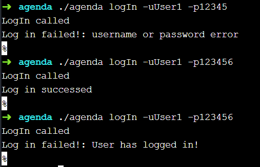  
        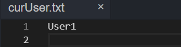  
* **<div id="5.2.3">用户登出: logOut</div>**  
    logOut进行用户登出  
    + 用户需要提供用户名和密码  
        ```go
        logOutCmd.Flags().StringP("username", "u", "username", "Username")
        logOutCmd.Flags().StringP("password", "p", "password", "Password")
        ```  
    + 比对用户名与密码是否正确，不正确则返回报错信息  
        ```go
        valid := s.QueryUser(func(user myAgenda.User) bool {
			return user.M_name == username && user.M_password == password
		})
		if valid.Len()==0{
			fmt.Fprintf(os.Stderr, "Log out failed!\n")
			return
		}
        ```
    + 判断用户是否已登录，未登录则返回报误信息  
        ```go  
        curValid := s.QueryCurUser(func(s string) bool {
			return s == username
		})

		if curValid.Len()==0{
			fmt.Fprintf(os.Stderr, "LogOut fail!: User not logged in!\n")
			return
		}
        ```  
    + 无误则进行用户登出，并输出成功信息  
        ```go  
        s.DeleteCurUser(username)
		s.WriteToFile()
		fmt.Println("LogOut successed")
        ```  
    + 测试:  
        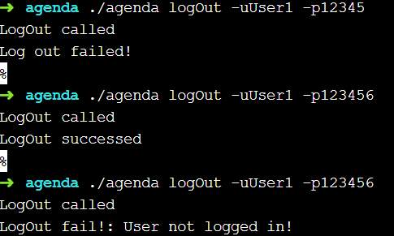  
        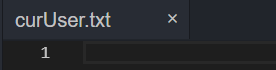  
* **<div id="5.2.4">用户删除: cancel</div>**  
    cancel进行用户注销  
    + 用户需要提供用户名和密码  
        ```go
        cancelCmd.Flags().StringP("username", "u", "username", "username")
        cancelCmd.Flags().StringP("password", "p", "password", "password")
        ```  
    + 比对用户名与密码是否正确，不正确则返回报错信息  
        ```go
        valid := s.QueryUser(func(user myAgenda.User) bool {
			return user.M_name == username && user.M_password == password
		})
		if valid.Len()==0{
			fmt.Fprintf(os.Stderr, "Cancel failed!: Incorrect username or password!\n")
			return
		}
        ```  
    + 注销时需要删除用户主持的所有会议  
        ```go
        s.DeleteMeeting(func(meeting myAgenda.Meeting) bool {
			return meeting.M_sponsor == username
		})
        ```  
    + 还需要将用户所有参与的会议中删除用户  
        ```go  
        s.UpdateMeeting(func(meeting myAgenda.Meeting) bool {
			return meeting.IsParticipator(username)
		}, func(meeting *myAgenda.Meeting) {
			meeting.RemoveParticipator(username)
		})
        ```  
    + 可能存在会议参与者为0的情况，需要将这些会议删除  
        ```go  
        s.DeleteMeeting(func(meeting myAgenda.Meeting) bool {
			return len(meeting.M_participators) == 0
		})
        ```  
    + 如果用户已登录，则从登陆列表中删除  
        ```go
        curValid := s.QueryCurUser(func(s string) bool {
			return s == username
		})

		if curValid.Len()!=0{
			s.DeleteCurUser(username)
		}
        ```
    + 最后进行用户删除，并输出成功信息  
        ```go
        s.DeleteUser(valid.Front().Value.(myAgenda.User))
		s.WriteToFile()
        fmt.Println("Cancel successed")  
        ```  
    + 测试(仅展示部分情况):  
        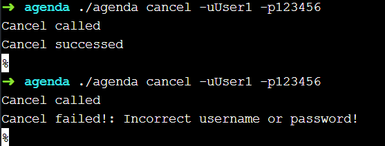  
        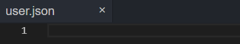  
* **<div id="5.2.5">用户查询: listUsers</div>**  
    listUsers列出当前存在的所有用户  
    + 用户需要提供一个已登录的用户名(因为允许多账号登陆)  
        ```go
	    listUsersCmd.Flags().StringP("username", "u", "username", "username")
        ```  
    + 判断用户提供的用户名是否已登录，未登录则返回报错信息  
        ```go
        curValid := s.QueryCurUser(func(s string) bool {
			return s == username
		})

		if curValid.Len()==0{
			fmt.Fprintf(os.Stderr, "ListUsers failed!: User not log in!\n")
			return
		}
        ```  
    + 若已登录则查询所有的用户并输出  
        ```go  
        valid := s.QueryUser(func(user myAgenda.User) bool {
			return true
		})

		for i:=valid.Front();i!=nil;i=i.Next(){
			fmt.Printf("Username: %s\tEmail: %s\tPhone: %s\n", i.Value.(myAgenda.User).M_name, i.Value.(myAgenda.User).M_email, i.Value.(myAgenda.User).M_phone)
		}
        ```  
    + 测试:  
        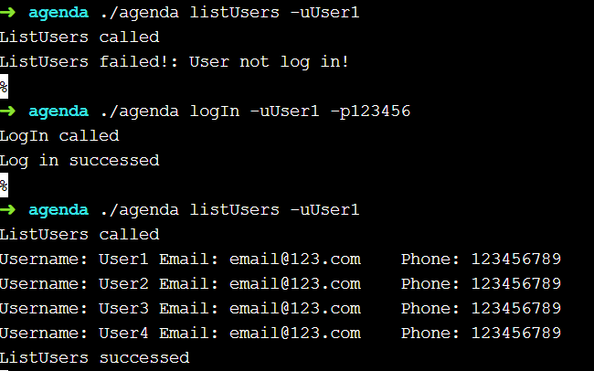  
* **<div id="5.2.6">创建会议: createMeeting</div>**  
    createMeeting用于创建会议  
    + 用户需要提供会议的主持人、标题、开始时间、结束时间、参与者人数(稍后会要求输入参与者)  
        ```go
        createMeetingCmd.Flags().StringP("sponsor", "u", "sponsor", "Sponsor of meeting")
        createMeetingCmd.Flags().StringP("title", "t", "title", "Title of meeting")
        createMeetingCmd.Flags().StringP("startTime", "s", "start time", "Start time of meeting(yyyy-mm-dd/hh:mm)")
        createMeetingCmd.Flags().StringP("endTime", "e", "end time", "End time of meeting(yyyy-mm-dd/hh:mm)")
        createMeetingCmd.Flags().IntP("participatorNumber", "p", 0, "Number of participator")
        ```
    + 主持人必须为已经登录的用户，若未登录，则输出报错信息  
        ```go  
        valid := s.QueryCurUser(func(username string) bool {
			return username == sponsor
		})

		if valid.Len() == 0 {
			fmt.Fprintf(os.Stderr, "Create Meeting failed!: Sponsor not log in!\n")
			return
		}
        ```  
    + 输入的日期必须有效，并且开始日期不能大于结束日期  
        ```go
        d1, d2 := myAgenda.StringToDate(startTime), myAgenda.StringToDate(endTime)

		if !(myAgenda.IsValid(d1) && myAgenda.IsValid(d2)) {
			fmt.Fprintf(os.Stderr, "Create Meeting failed!: StartDate or endDate isn't valid!\n")
			return
		}

		if myAgenda.CompareDate(d1, d2) != -1 {
			fmt.Fprintf(os.Stderr, "Create Meeting failed!: StartDate more than or equal to endDate!\n")
			return
		}
        ```  
    + 参与者人数必须大于0，否则报错  
        ```go  
        if participatorNumberTime <= 0 {
			fmt.Fprintf(os.Stderr, "Create Meeting failed!: The num of participator less than or equal zero!\n")
			return
		}
        ```  
    + 会议标题不能重复，否则报错  
        ```go
        valid = s.QueryMeeting(func(meeting myAgenda.Meeting) bool {
			return meeting.M_title == title
		})

		if valid.Len() != 0 {
			fmt.Fprintf(os.Stderr, "Create Meeting failed!: Title has existed!\n")
			return
		}
        ```
    + 无误则要求用户输入参与者  
        ```go
        var participators []string
		for i := 0; i < participatorNumberTime; i++ {
			fmt.Printf("Please enter NO.%d participator: ", i+1)
			var participator string
			fmt.Scanf("%s\n", &participator)
			participators = append(participators, participator)
		}
        ```  
    + 检查主持人是否存在时间冲突(其参与的会议时间不能重叠)  
        ```go
		valid = s.QueryMeeting(func(meeting myAgenda.Meeting) bool {
			return (!((myAgenda.CompareDate(meeting.M_startDate, d2) >= 0) || (myAgenda.CompareDate(meeting.M_endDate, d1) <= 0))) && (meeting.IsParticipator(sponsor) || (meeting.M_sponsor == sponsor))
		})

		if valid.Len() != 0 
			fmt.Fprintf(os.Stderr, "Create Meeting failed!: Conflicting meeting of sponsor!(date)\n")
			return
		}
        ```
    + 对于每个参与者进行检测：参与者必须已注册、主持人不能是参与者、不能有相同的参与者、不能存在时间冲突  
        ```go
		for i := 0; i < len(participators); i++ {
			if participators[i] == sponsor {
				fmt.Fprintf(os.Stderr, "Create Meeting failed!: The sponsor can't be the participator!\n")
				return
			}

			valid := s.QueryUser(func(user myAgenda.User) bool {
				return user.M_name == participators[i]
			})

			if valid.Len() == 0 {
				fmt.Fprintf(os.Stderr, "Create Meeting failed!: Participator isn't in user!\n")
				return
			}

			valid = s.QueryMeeting(func(meeting myAgenda.Meeting) bool {
				return (!((myAgenda.CompareDate(meeting.M_startDate, d2) >= 0) || (myAgenda.CompareDate(meeting.M_endDate, d1) <= 0))) && (meeting.IsParticipator(participators[i]) || (meeting.M_sponsor == participators[i]))
			})

			if valid.Len() != 0 {
				fmt.Fprintf(os.Stderr, "Create Meeting failed!: Conflicting meeting of participator!(date)\n")
				return
			}

			for j := i+1; j < len(participators); j++ {
				if participators[i] == participators[j] {
					fmt.Fprintf(os.Stderr, "Create Meeting failed!: Multiple participator!\n")
					return
				}
			}
		}
        ```
    + 无误则创建会议并输出成功信息  
        ```go
		meeting := myAgenda.Meeting{
			sponsor,
			participators,
			d1,
			d2,
			title,
		}

		s.CreateMeeting(meeting)
		s.WriteToFile()
		fmt.Println("CreateMeeting successed")        
        ```  
    + 测试: 
        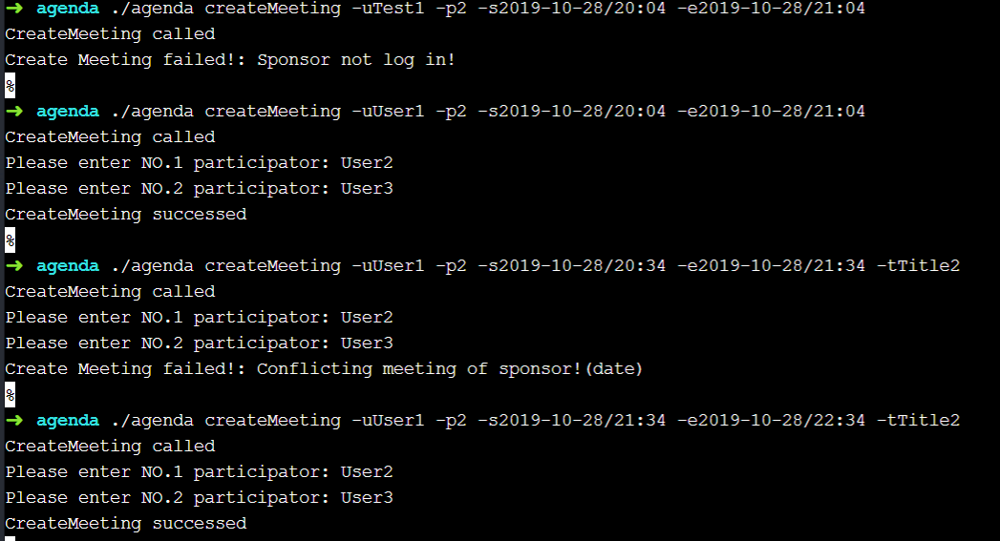  
        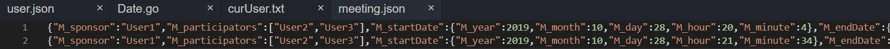  
* **<div id="5.2.7">增加会议参与者: addMeetingParticipator</div>**  
    addMeetingParticipator用于添加会议的参与者  
    + 用户需要输入主持人、标题、待添加的参与者
        ```go
    	addMeetingParticipatorCmd.Flags().StringP("sponsor", "u", "sponsor", "Sponsor of meeting")
        addMeetingParticipatorCmd.Flags().StringP("title", "t", "title", "Title of meeting")
        addMeetingParticipatorCmd.Flags().StringP("participator", "p", "participator", "participator need to be added")
        ```  
    + 判断主持人与参与者是否合法: 主持人需登录、参与者需注册且不与主持人相同  
        ```go
        if sponsor == participator {
			fmt.Fprintf(os.Stderr, "AddMeetingParticipator failed!: The sponsor can't be the participator!\n")
			return
		}

		valid := s.QueryCurUser(func(username string) bool {
			return username == sponsor
		})

		if valid.Len() == 0 {
			fmt.Fprintf(os.Stderr, "AddMeetingParticipator failed!: Sponsor not log in!\n")
			return
		}

		valid = s.QueryUser(func(user myAgenda.User) bool {
			return user.M_name == participator
		})

		if valid.Len() == 0 {
			fmt.Fprintf(os.Stderr, "AddMeetingParticipator failed!: Participator isn't in user!\n")
			return
		}
        ```  
    + 参与者不能存在时间冲突  
        ```go
		cnt := s.UpdateMeeting(func(meeting myAgenda.Meeting) bool {
			if meeting.M_title == title && meeting.M_sponsor == sponsor && !meeting.IsParticipator(participator) {
				valid = s.QueryMeeting(func(meeting2 myAgenda.Meeting) bool {
					return (!(myAgenda.CompareDate(meeting2.M_startDate, meeting.M_endDate) >= 0 || myAgenda.CompareDate(meeting2.M_endDate, meeting.M_startDate) <= 0)) && (meeting2.IsParticipator(participator) || meeting2.M_sponsor == participator)
				})
				return valid.Len() == 0
			}
			return false
		}, func(meeting *myAgenda.Meeting) {
			meeting.AddParticipator(participator)
		})

		if cnt == 0 {
			fmt.Fprintf(os.Stderr, "AddMeetingParticipator failed!: Conflicting meeting of participator!(date or title)\n")
			return
		}
        ```  
    + 无误则将参与者添加到会议当中  
        ```go
		s.WriteToFile()
		fmt.Println("AddMeetingParticipator successed")
        ```  
    + 测试: 
        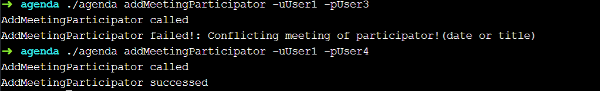  
        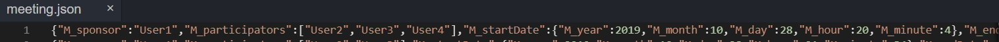  
* **<div id="5.2.8">查询会议: meetingQuery</div>**  
    meetingQuery用于查询会议  
    + 用户需要提供用户名、开始时间、结束时间  
        ```go  
        meetingQueryCmd.Flags().StringP("username", "u", "username", "Username")
        meetingQueryCmd.Flags().StringP("startTime", "s", "start time", "Start time(yyyy-mm-dd/hh:mm)")
        meetingQueryCmd.Flags().StringP("endTime", "e", "end time", "End time(yyyy-mm-dd/hh:mm)")
        ```
    + 用户需要登录，未登录则报错  
        ```go  
        valid := s.QueryCurUser(func(user string) bool {
			return user == username
		})

		if valid.Len() == 0 {
			fmt.Fprintf(os.Stderr, "MeetingQuery failed!: User not log in!\n")
			return
		}
        ```  
    + 通过查询找出在用户主持或参与的时间段内的所有会议  
        ```go
        d1, d2 := myAgenda.StringToDate(startTime), myAgenda.StringToDate(endTime)

		if myAgenda.IsValid(d1)&&myAgenda.IsValid(d2){
			valid := s.QueryMeeting(func(meeting myAgenda.Meeting) bool {
				return (meeting.M_sponsor==username||meeting.IsParticipator(username))&&!(myAgenda.CompareDate(d2,meeting.M_startDate)<0||myAgenda.CompareDate(d1,meeting.M_endDate)>0)
			})

			for i:=valid.Front();i!=nil;i=i.Next(){
				met := i.Value.(myAgenda.Meeting)
				fmt.Printf("Title: %s\tSponser: %s\tStart Time: %s\tEnd Time: %s\tParticipators: %s\n", met.M_title,met.M_sponsor, met.M_startDate.DateToString(), met.M_endDate.DateToString(), met.M_participators)
			}
		}

        fmt.Println("MeetingQuery successed")  
        ```
    + 测试:  
        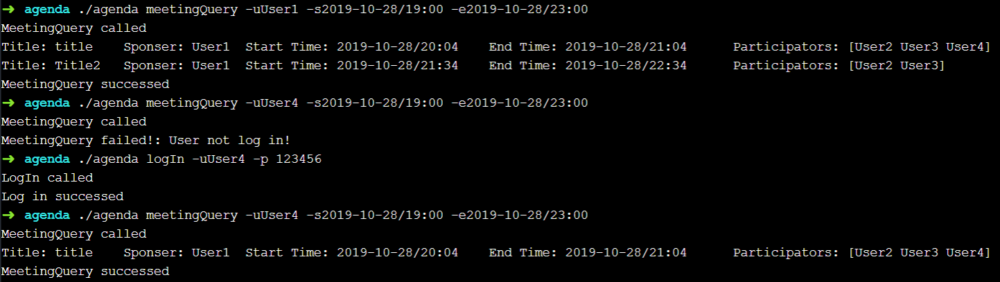  
* **<div id="5.2.9">删除会议参与者: removeMeetingParticipator</div>**  
    removeMeetingParticipator用于移除会议中的参与者  
    + 用户需要提供主持人、标题、待删除的参与者  
        ```go
        removeMeetingParticipatorCmd.Flags().StringP("sponsor", "u", "sponsor", "Sponsor of meeting")
        removeMeetingParticipatorCmd.Flags().StringP("title", "t", "title", "Title of meeting")
        removeMeetingParticipatorCmd.Flags().StringP("participator", "p", "participator", "Participator need to be removed")
        ```
    + 主持人必须已登录  
        ```go
        valid := s.QueryCurUser(func(username string) bool {
			return username == sponsor
		})

		if valid.Len() == 0 {
			fmt.Fprintf(os.Stderr, "RemoveMeetingParticipator failed!: Sponsor not log in!\n")
			return
		}
        ```  
    + 查找匹配的会议，并将参与者从中删除  
        ```go
        cnt:=s.UpdateMeeting(func(meeting myAgenda.Meeting) bool {
			return (meeting.M_title==title)&&(meeting.M_sponsor==sponsor)&&(meeting.IsParticipator(participator))
		}, func(meeting *myAgenda.Meeting) {
			meeting.RemoveParticipator(participator)
		})

		if cnt==0{
			fmt.Fprintf(os.Stderr, "RemoveMeetingParticipator failed!: No matching meeting or participator!\n")
			return
		}
        ```  
    + 可能存在参与者为0的会议，将其删除  
        ```go
		s.DeleteMeeting(func(meeting myAgenda.Meeting) bool {
			return len(meeting.M_participators) == 0
		})

		s.WriteToFile()

		fmt.Println("RemoveMeetingParticipator successed")
        ```  
    + 测试: 
        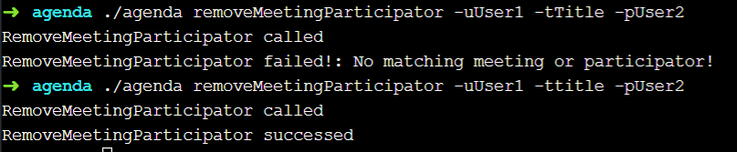  
* **<div id="5.2.10">退出会议: quitMeeting</div>**  
    quitMeeting用于退出一个会议  
    + 用户需要提供用户名、标题  
        ```go  
        quitMeetingCmd.Flags().StringP("username", "u", "username", "Username")
	    quitMeetingCmd.Flags().StringP("title", "t", "title", "Title of meeting")
        ```  
    + 用户必须已登录，否则报错  
        ```go
        valid := s.QueryCurUser(func(user string) bool {
			return user == username
		})

		if valid.Len() == 0 {
			fmt.Fprintf(os.Stderr, "QuitMeeting failed!: User not log in!\n")
			return
		}
        ```  
    + 查询符合条件的会议，并将用户从参与者中删除  
        ```go
        cnt:=s.UpdateMeeting(func(meeting myAgenda.Meeting) bool {
			return meeting.M_title==title&&meeting.IsParticipator(username)&&meeting.M_sponsor!=username
		}, func(meeting *myAgenda.Meeting) {
			meeting.RemoveParticipator(username)
		})

		if cnt==0{
			fmt.Fprintf(os.Stderr, "QuitMeeting failed!: No matching meeting for username or username is the sponsor!\n")
			return
		}
        ```  
    + 可能存在参与者为0的会议，将其删除  
        ```go
        s.DeleteMeeting(func(meeting myAgenda.Meeting) bool {
			return len(meeting.M_participators) == 0
		})
        ```  
    + 测试:  
        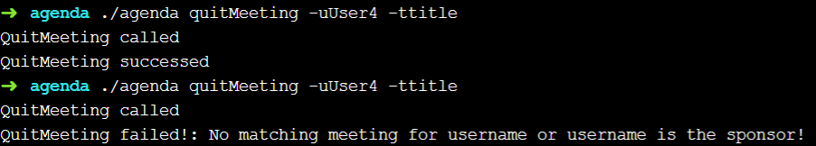  
* **<div id="5.2.11">取消会议: deleteMeeting</div>**  
    deleteMeeting用于删除一个会议  
    + 用户需要输入主持人、标题  
        ```go
        deleteMeetingCmd.Flags().StringP("sponsor", "u", "sponsor", "Sponsor of meeting")
	    deleteMeetingCmd.Flags().StringP("title", "t", "title", "Title of meeting")
        ```  
    + 主持人必须已登录，否则报错  
        ```go
        valid := s.QueryCurUser(func(username string) bool {
			return username == sponsor
		})

		if valid.Len() == 0 {
			fmt.Fprintf(os.Stderr, "DeleteMeeting failed!: Sponsor not log in!\n")
			return
		}
        ```  
    + 查询符合条件的会议并将其删除  
        ```go
        cnt:=s.DeleteMeeting(func(meeting myAgenda.Meeting) bool {
			return meeting.M_sponsor==sponsor&&meeting.M_title==title
		})

		if cnt==0{
			fmt.Fprintf(os.Stderr, "DeleteMeeting failed!: No matching meeting for username!\n")
			return
		}

		s.WriteToFile()
        fmt.Println("DeleteMeeting successed")  
        ```  
    + 测试:  
        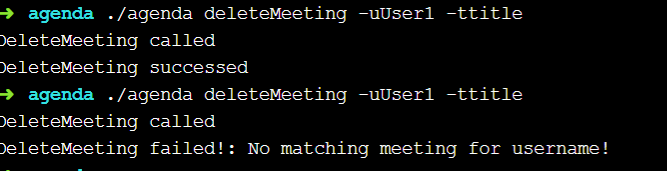  
* **<div id="5.2.12">清空会议: deleteAllMeeting</div>**  
    deleteAllMeeting用于清空会议  
    + 用户需要输入主持人  
        ```go
        deleteAllMeetingCmd.Flags().StringP("sponsor", "u", "sponsor", "Sponsor")
        ```
    + 主持人必须已登录，否则报错  
        ```go
        valid := s.QueryCurUser(func(username string) bool {
			return username == sponsor
		})

		if valid.Len() == 0 {
			fmt.Fprintf(os.Stderr, "DeleteAllMeeting failed!: Sponsor not log in!\n")
			return
		}
        ```  
    + 将主持人创建的所有会议删除  
        ```go
        cnt:=s.DeleteMeeting(func(meeting myAgenda.Meeting) bool {
			return meeting.M_sponsor == sponsor
		})

		if cnt==0{
			fmt.Fprintf(os.Stderr, "DeleteAllMeeting failed!: No matching meeting for username!\n")
			return
		}

		s.WriteToFile()
		fmt.Println("DeleteAllMeeting successed")
        ```  
    + 测试:  
        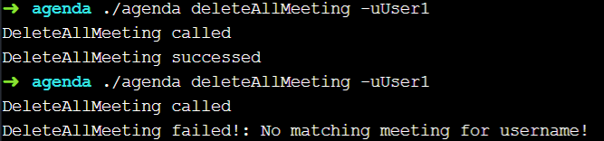