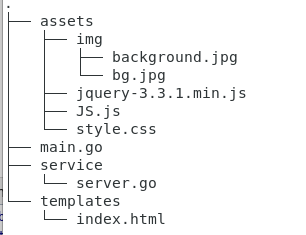
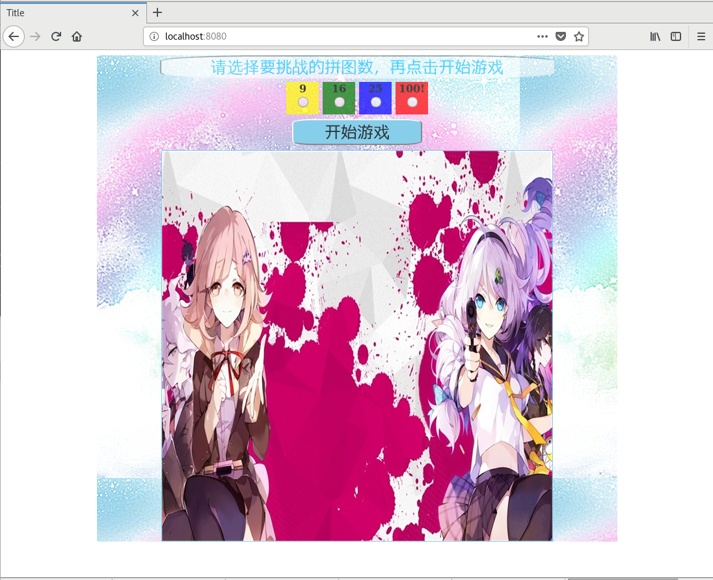
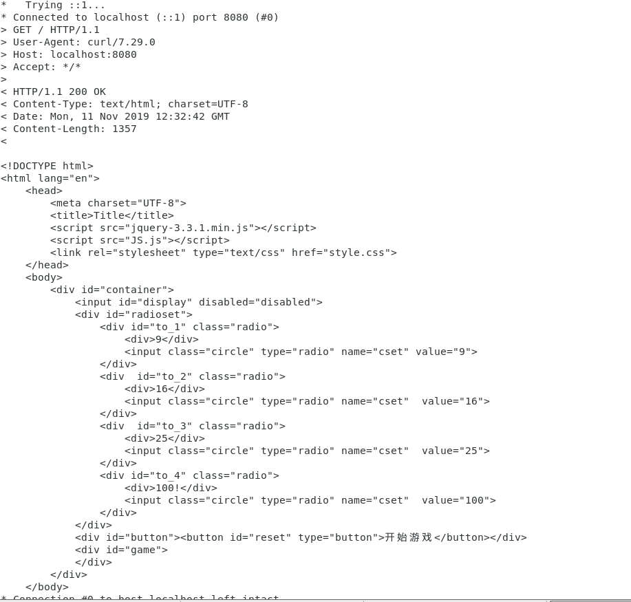
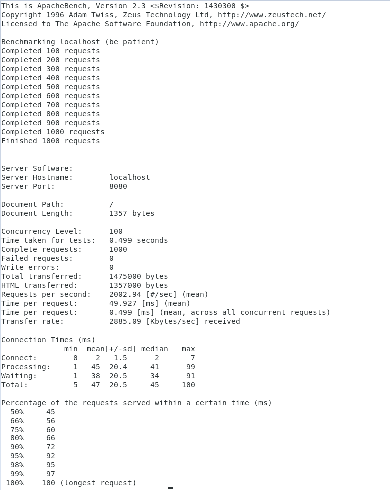

# **开发 web 服务程序**  
## **前言**
这是中山大学数据科学与计算机学院2019年服务计算的作业项目。所有代码与博客将被上传至github当中。  
Github项目地址: [https://github.com/StarashZero/ServerComputing/tree/master/hw5](https://github.com/StarashZero/ServerComputing/tree/master/hw5)  
个人主页: [https://starashzero.github.io](https://starashzero.github.io)   
实验要求: [https://pmlpml.github.io/ServiceComputingOnCloud/ex-cloudgo-start](https://pmlpml.github.io/ServiceComputingOnCloud/ex-cloudgo-start)  
## **1、**概述****
  开发简单 web 服务程序 cloudgo，了解 web 服务器工作原理。  

## **2、项目要求**  
* 编程 web 服务程序 类似 cloudgo 应用。
    + 要求有详细的注释
    + 是否使用框架、选哪个框架自己决定 请在 README.md 说明你决策的依据
* 使用 curl 测试，将测试结果写入 README.md
* 使用 ab 测试，将测试结果写入 README.md。并解释重要参数。 

## **3、程序思路**  
* 程序框架   
    程序使用```martini```框架进行编写，主要原因有三:  
    * martini提供的函数调用比较简洁，学习难度不大  
    * martini可查找的资料较多，便于入门  
    * martini比较适合这次作业项目代码编写  

* 项目框架:  
      
    其中templates与assets提供前端界面，代码来自过去曾做过的web应用([在线试玩](https://starashzero.github.io/Web-homework/fifteenpuzzle/index.html))  
    main.go与service提供后端支持，main.go与service的编写结构借鉴了[潘老师课程博客](https://blog.csdn.net/pmlpml/article/details/78404838)的cloudgo代码   
* 简要思路  
    完成了一个简单的cloudgo程序，将一个html界面显示在浏览器上  
      


## **4、代码实现**  
前端代码解释暂略  
* main.go  
    main.go主要用于获得用户提供的参数(端口号)或者使用默认端口号，并将信息传递给service启动服务器  
    ```go  
    const (
        //set a default port
        PORT string = "8080"
    )

    func main(){
        port := os.Getenv("PORT")
        //use default port
        if len(port) == 0{
            port = PORT
        }
        //allow user set another port
        pPort :=  pflag.StringP("port", "p", PORT, "PORT for httpd listening")
        pflag.Parse()
        //if user set a port, use it
        if len(*pPort)!=0{
            port = *pPort
        }
        //run server
        service.NewServer(port)
    }
    ```  
* server.go  
    server.go实现服务端代码  
    + 主要做的工作是设置render的模板为html，并将GET导向index.html  
    + index.html所需的资源(image, js, css等)在assets文件夹中，设置其路径  
    + 在指定的端口号上启动服务
    ```go  
    func NewServer(port string) {
        //get a martini
        m := martini.Classic()
        //set assets path
        m.Use(martini.Static("assets"))
        //set render template
        m.Use(render.Renderer(render.Options{
            Directory:  "templates",
            Extensions: []string{".html"},
            IndentJSON: true,
        }))
        //deal with get request
        m.Get("/", func(r render.Render) {
            r.HTML(200, "index", nil)
        })
        //run martini
        m.RunOnAddr(":" + port)
    }
    ```  

## **5、程序测试**  
* curl  
     
    curl符号:   
    * \* 表示 curl 任务；
    * \> 发送的信息
    * < 返回的信息  

    在curl中展示了request和reponse包的详细信息，reponse中还携带了index.html的代码   
* ab  
    使用ab进行压力测试  
      
    一些参数解释  
      
    参数| 解释|  
    -|-|  
    Server Hostname| 服务器域名|  
    Server Port|服务器端口|  
    Concurrency Level|此次测试的一轮request的并发数|  
    Time taken for tests|测试的时长|  
    Complete request|完成的request测试数|  
    Request per second|每秒完成的request数|  
    Time per request|每次request所用的时间|   
    Connection Times|各阶段所需的时间|  