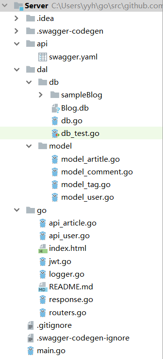

# web 服务与客户端开发实战总结

## **前言**
这是中山大学数据科学与计算机学院2019年服务计算的作业项目。所有代码与博客将被上传至github当中。  
Github项目地址: [https://github.com/BlogFourByMan](https://github.com/BlogFourByMan)  
个人主页: [https://starashzero.github.io](https://starashzero.github.io)  

## **概述**  
我们小组四人完成了一个前后端分离的web博客应用——Simple Blog  
目前支持的功能有:  
* 注册
* 登陆
* 查看博客
* 查看评论
* 发表评论  

## **工作简述**  
我在小组中主要负责后端User相关的API代码编写  
* 项目结构:  
      
* db包存放数据库相关代码，数据库使用BoltDB  
* model包存放需要用到的数据结构
* go包实现api代码    

## **开发过程**
* **db**  
    db实现数据库代码，数据库使用BoltDB，使用方法为Key:Value  
    我实现了与User有关的数据库代码  
    * GetUser  
        GetUser实现对用户信息的查询，输入参数为username，输出结果为User信息  
        默认将Username和Password均为""的User作为查询失败的标识
        ```go
        func GetUser(username string) model.User {
            db, err := bolt.Open(GetDBPATH(), 0600, nil)
            if err != nil {
                log.Fatal(err)
            }
            defer db.Close()

            user := model.User{
                Username: "",
                Password: "",
            }

            err = db.View(func(tx *bolt.Tx) error {
                b := tx.Bucket([]byte("user"))
                if b != nil {
                    data := b.Get([]byte(username))
                    if data != nil {
                        err := json.Unmarshal(data, &user)
                        if err != nil {
                            log.Fatal(err)
                        }
                    }
                }
                return nil
            })
            if err != nil {
                log.Fatal(err)
            }

            return user
        }
        ```  
    * PutUsers  
        PutUsers实现User数据的添加，输入参数为User数组(支持一次添加多个)，返回报错信息  
        ```go
        func PutUsers(users []model.User) error {
            db, err := bolt.Open(GetDBPATH(), 0600, nil)
            if err != nil {
                log.Fatal(err)
            }
            defer db.Close()

            err = db.Update(func(tx *bolt.Tx) error {
                b := tx.Bucket([]byte("user"))
                if b != nil {
                    for i := 0; i < len(users); i++ {
                        username := users[i].Username
                        data, _ := json.Marshal(users[i])
                        b.Put([]byte(username), data)
                    }
                }
                return nil
            })

            if err != nil {
                return err
            }
            return nil
        }
        ```  
* **model**  
    在开发过程中需要用到几个数据结构  
    * User  
        User是存储用户信息的数据结构，目前比较简单，只存放了用户名和密码  
        ```go
        type User struct {
            Username string `json:"username,omitempty"`

            Password string `json:"password,omitempty"`
        }        
        ```  
    * Comment  
        Comment类存放评论信息，包括评论用户、文章id、评论信息、评论内容等    
        ```go
        type Comment struct {
            User string `json:"user,omitempty"`

            ArticleId int64 `json:"article_id,omitempty"`

            Date string `json:"date,omitempty"`

            Content string `json:"content,omitempty"`
        }
        ```  

* **go**  
    go包实现API代码  
    * response.go  
        response.go用来统一处理Response  
        MyResponse结构用来存储Response信息  
        Options单独处理OPTIONS(当需要loken认证时，会提前收到一个OPTIONS包)  
        Response用来发送回复信息  
        ```go
        type MyResponse struct {
            OkMessage    interface{} `json:"ok,omitempty"`
            ErrorMessage interface{} `json:"error,omitempty"`
        }

        func Options(w http.ResponseWriter, r *http.Request){
            w.Header().Set("Content-Type", "application/json; charset=UTF-8")
            w.Header().Set("Access-Control-Allow-Methods","PUT,POST,GET,DELETE,OPTIONS")
            w.Header().Set("Access-Control-Allow-Headers", "Content-Type, Access-Control-Allow-Origin, Access-Control-Allow-Credentials, Access-Control-Allow-Methods, Access-Control-Allow-Headers, Authorization, X-Requested-With")
            w.Header().Set("Access-Control-Allow-Origin", "*")
            w.WriteHeader(http.StatusOK)
        }

        func Response(response interface{}, w http.ResponseWriter, code int) {
            jsonData, jErr := json.Marshal(&response)

            if jErr != nil {
                log.Fatal(jErr.Error())
            }

            w.Header().Set("Content-Type", "application/json; charset=UTF-8")
            w.Header().Set("Access-Control-Allow-Methods","PUT,POST,GET,DELETE,OPTIONS")
            w.Header().Set("Access-Control-Allow-Headers", "Content-Type, Access-Control-Allow-Origin, Access-Control-Allow-Credentials, Access-Control-Allow-Methods, Access-Control-Allow-Headers, Authorization, X-Requested-With")
            w.Header().Set("Access-Control-Allow-Origin", "*")
            w.Write(jsonData)
            w.WriteHeader(code)
        }
        ```  
    * api_user.go  
        api_user.go实现User相关的API:  
        * POST /article/{id}/comments  
        * POST /user/login
        * POST /user/register  
        
        我主要负责这三个方面的开发，不过loken认证由另一位组员完成  
        * login与register  
            login和register的实现大同小异  
            * 首先读取body当中的参数，将其转为User结构体  
                ```go
                err := json.NewDecoder(r.Body).Decode(&user)
                ```  
            * 从数据库中获得用户名对应的User信息  
                ```go
                check := db.GetUser(user.Username)
                ```  
            * 对用户信息进行验证，例如验证用户是否存在，账户与密码是否对应等等  
            * 最后返回token  
                ```go
                Response(MyResponse{
                    tokenString,
                    nil,
                }, w, http.StatusOK)
                ```  
            * CommentPost  
                添加评论需要对用户进行验证，主要流程如下:  
                * 验证用户token  
                    ```go
                    token, isValid := ValidateToken(w, r)
                    ```  
                * 读入body参数，并解码为Comment结构 

                    ```go
                    err := json.NewDecoder(r.Body).Decode(&comment)
                    ```  
                * 根据token更新User 

                    ```go
                    if v, ok := token.Claims.(jwt.MapClaims); ok {
                        name, _ := v["name"].(string)
                        comment.User = name
                    }
                    ```
                * 获得文章id  

                    ```go
                    articleId := strings.Split(r.URL.Path, "/")[2]
                    comment.ArticleId, err = strconv.ParseInt(articleId, 10, 64)
                    ```  
                * 生成时间  

                    ```go
                    comment.Date = fmt.Sprintf("%d-%d-%d", time.Now().Year(), time.Now().Month(), time.Now().Day())
                    ```  
                * 将评论加入到数据库中

                    ```go
                    for i := 0; i < len(articles); i++ {
                        articles[i].Comments = append(articles[i].Comments, comment)
                    }

                    err = db.PutArticles(articles)
                    ```  
                * 返回评论数据

                    ```go
                    Response(MyResponse{
                        comment,
                        nil,
                    }, w, http.StatusOK)
                    ```