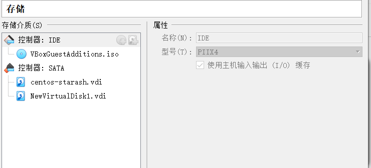

# Centos7: Docker安装与实践  

# web 服务与客户端开发实战总结

## **前言**
这是中山大学数据科学与计算机学院2019年服务计算的作业项目。所有代码与博客将被上传至github当中。  
Github项目地址: [https://github.com/StarashZero/ServerComputing/tree/master/hw8](https://github.com/StarashZero/ServerComputing/tree/master/hw8)  
个人主页: [https://starashzero.github.io](https://starashzero.github.io)    

## **实验过程**  

### **准备Docker环境**  
* 升级内核版本  
    * 内核版本过低时需要将内核升级  
        ```
        uname -r
        3.10.0-957.27.2.el7.x86_64
        ```
    * 导入key  
        ```
        sudo rpm --import https://www.elrepo.org/RPM-GPG-KEY-elrepo.org
        ```  
    * 安装elrepo的yum源
        ```
        sudo rpm -Uvh http://www.elrepo.org/elrepo-release-7.0-2.el7.elrepo.noarch.rpm
        ```  
    * 安装内核  
        ```
        sudo yum --enablerepo=elrepo-kernel install  kernel-ml-devel kernel-ml  
        ```
        新内核版本是  5.4.3
        ```
        Installing:
        kernel-ml           x86_64     5.4.3-1.el7.elrepo      elrepo-kernel      48 M
        kernel-ml-devel     x86_64     5.4.3-1.el7.elrepo      elrepo-kernel      13 M

        ```  
    * 查看默认启动顺序  
        ```
        sudo awk -F\' '$1=="menuentry " {print $2}' /etc/grub2.cfg  
        CentOS Linux (5.4.3-1.el7.elrepo.x86_64) 7 (Core)
        CentOS Linux (3.10.0-957.27.2.el7.x86_64) 7 (Core)
        CentOS Linux (3.10.0-957.el7.x86_64) 7 (Core)
        CentOS Linux (0-rescue-9824227b799a461990b090d27888ef99) 7 (Core)
        ```  
    * 选择内核  
        ```
        sudo grub2-set-default 0  
        ```  
    * 重启后查看内核  
        ```
        Could not mount the media/drive 'E:\Oracle\Virtualbox\VBoxGuestAdditions.iso' (VERR_PDM_MEDIA_LOCKED).
        ```  
    * 删除旧的内核  
        ```
        sudo yum remove kernel
        ```  
    * 更新，升级完成  
        ```
        sudo yum update  
        ```  
### **安装Docker**  
* 使用国内阿里云安装  
    ```
    sudo yum-config-manager --add-repo http://mirrors.aliyun.com/docker-ce/linux/centos/docker-ce.repo  
    sudo yum install docker-ce
    ```
* 设置文件系统  
    * 使用VirtualBox为虚拟机挂载一个新硬盘  
      
    * 查看挂载之后的硬盘信息(sdb)  
    ```
    [starash@localhost ~]$ sudo fdisk -l
    [sudo] password for starash: 

    Disk /dev/sdb: 8589 MB, 8589934592 bytes, 16777216 sectors
    Units = sectors of 1 * 512 = 512 bytes
    Sector size (logical/physical): 512 bytes / 512 bytes
    I/O size (minimum/optimal): 512 bytes / 512 bytes


    Disk /dev/sda: 53.7 GB, 53687091200 bytes, 104857600 sectors
    Units = sectors of 1 * 512 = 512 bytes
    Sector size (logical/physical): 512 bytes / 512 bytes
    I/O size (minimum/optimal): 512 bytes / 512 bytes
    Disk label type: dos
    Disk identifier: 0x000ed733

    Device Boot      Start         End      Blocks   Id  System
    /dev/sda1   *        2048     2099199     1048576   83  Linux
    /dev/sda2         2099200   104857599    51379200   8e  Linux LVM

    Disk /dev/mapper/centos-root: 49.9 GB, 49920606208 bytes, 97501184 sectors
    Units = sectors of 1 * 512 = 512 bytes
    Sector size (logical/physical): 512 bytes / 512 bytes
    I/O size (minimum/optimal): 512 bytes / 512 bytes


    Disk /dev/mapper/centos-swap: 2684 MB, 2684354560 bytes, 5242880 sectors
    Units = sectors of 1 * 512 = 512 bytes
    Sector size (logical/physical): 512 bytes / 512 bytes
    I/O size (minimum/optimal): 512 bytes / 512 bytes
    ```  
    * 将硬盘格式化为xfs，并且挂载  
    ```
    [starash@localhost ~]$ sudo mkfs.xfs -n ftype=1 /dev/sdb 
    meta-data=/dev/sdb               isize=512    agcount=4, agsize=524288 blks
            =                       sectsz=512   attr=2, projid32bit=1
            =                       crc=1        finobt=0, sparse=0
    data     =                       bsize=4096   blocks=2097152, imaxpct=25
            =                       sunit=0      swidth=0 blks
    naming   =version 2              bsize=4096   ascii-ci=0 ftype=1
    log      =internal log           bsize=4096   blocks=2560, version=2
            =                       sectsz=512   sunit=0 blks, lazy-count=1
    realtime =none                   extsz=4096   blocks=0, rtextents=0
    [starash@localhost ~]$ sudo mount /dev/sdb /data
    [starash@localhost ~]$ sudo vim /etc/fstab 
    /dev/vdc  /data                  xfs    defaults        1   2
    ```  
    * 转移docker默认安装路径到新的路径
    ```
    [starash@localhost ~]$ service docker stop
    Redirecting to /bin/systemctl stop docker.service
    [starash@localhost ~]$ sudo mkdir /var/lib/docker
    [starash@localhost ~]$ sudo mv /var/lib/docker /data/docker
    [starash@localhost ~]$ sudo ln -s /data/docker/ /var/lib/docker
    [starash@localhost ~]$ service docker start
    ```  
    * 查看信息，确认  
    ```
    [starash@localhost ~]$ xfs_info /data
    meta-data=/dev/sdb               isize=512    agcount=4, agsize=524288 blks
            =                       sectsz=512   attr=2, projid32bit=1
            =                       crc=1        finobt=0 spinodes=0
    data     =                       bsize=4096   blocks=2097152, imaxpct=25
            =                       sunit=0      swidth=0 blks
    naming   =version 2              bsize=4096   ascii-ci=0 ftype=1
    log      =internal               bsize=4096   blocks=2560, version=2
            =                       sectsz=512   sunit=0 blks, lazy-count=1
    realtime =none                   extsz=4096   blocks=0, rtextents=0
    [starash@localhost ~]$ docker info
    Client:
    Debug Mode: false

    Server:
    ERROR: Got permission denied while trying to connect to the Docker daemon socket at unix:///var/run/docker.sock: Get http://%2Fvar%2Frun%2Fdocker.sock/v1.40/info: dial unix /var/run/docker.sock: connect: permission denied
    errors pretty printing info
    [starash@localhost ~]$ sudo docker info
    Client:
    Debug Mode: false

    Server:
    Containers: 0
    Running: 0
    Paused: 0
    Stopped: 0
    Images: 0
    Server Version: 19.03.5
    Storage Driver: overlay2
    Backing Filesystem: xfs
    Supports d_type: true
    Native Overlay Diff: true
    Logging Driver: json-file
    Cgroup Driver: cgroupfs
    Plugins:
    Volume: local
    Network: bridge host ipvlan macvlan null overlay
    Log: awslogs fluentd gcplogs gelf journald json-file local logentries splunk syslog
    Swarm: inactive
    Runtimes: runc
    Default Runtime: runc
    Init Binary: docker-init
    containerd version: b34a5c8af56e510852c35414db4c1f4fa6172339
    runc version: 3e425f80a8c931f88e6d94a8c831b9d5aa481657
    init version: fec3683
    Security Options:
    seccomp
    Profile: default
    Kernel Version: 5.4.3-1.el7.elrepo.x86_64
    Operating System: CentOS Linux 7 (Core)
    OSType: linux
    Architecture: x86_64
    CPUs: 4
    Total Memory: 5.809GiB
    Name: localhost.localdobackup
    ID: PSWX:35TU:2M5Q:ZDAS:JNF4:YTTS:X3FZ:BQNM:4FB7:SEUL:42NG:MBKC
    Docker Root Dir: /data/docker
    Debug Mode: false
    Registry: https://index.docker.io/v1/
    Labels:
    Experimental: false
    Insecure Registries:
    127.0.0.0/8
    Live Restore Enabled: false

    WARNING: bridge-nf-call-iptables is disabled
    WARNING: bridge-nf-call-ip6tables is disabled
    ```  
* Docker基本操作  
    * 运行hello-world镜像  
    ```
    [starash@localhost ~]$ sudo docker run hello-world

    Hello from Docker!
    This message shows that your installation appears to be working correctly.

    To generate this message, Docker took the following steps:
    1. The Docker client contacted the Docker daemon.
    2. The Docker daemon pulled the "hello-world" image from the Docker Hub.
        (amd64)
    3. The Docker daemon created a new container from that image which runs the
        executable that produces the output you are currently reading.
    4. The Docker daemon streamed that output to the Docker client, which sent it
        to your terminal.

    To try something more ambitious, you can run an Ubuntu container with:
    $ docker run -it ubuntu bash

    Share images, automate workflows, and more with a free Docker ID:
    https://hub.docker.com/

    For more examples and ideas, visit:
    https://docs.docker.com/get-started/
    ```  
    * 运行ubuntu镜像  
    ```
    [starash@localhost ~]$ sudo docker run -it ubuntu bash
    Unable to find image 'ubuntu:latest' locally
    latest: Pulling from library/ubuntu
    7ddbc47eeb70: Pull complete 
    c1bbdc448b72: Pull complete 
    8c3b70e39044: Pull complete 
    45d437916d57: Pull complete 
    Digest: sha256:6e9f67fa63b0323e9a1e587fd71c561ba48a034504fb804fd26fd8800039835d
    Status: Downloaded newer image for ubuntu:latest
    root@8379cc818b3a:/# ls
    bin   dev  home  lib64  mnt  proc  run   srv  tmp  var
    boot  etc  lib   media  opt  root  sbin  sys  usr
    root@8379cc818b3a:/# exit
    exit
    ```  
    * 显示本地库信息  
    ```
    [starash@localhost ~]$ sudo docker images
    [sudo] password for starash: 
    REPOSITORY          TAG                 IMAGE ID            CREATED             SIZE
    ubuntu              latest              775349758637        6 weeks ago         64.2MB
    hello-world         latest              fce289e99eb9        11 months ago
    ```
    * 获得帮助  
    ```
    [starash@localhost ~]$ sudo docker --help

    Usage:	docker [OPTIONS] COMMAND

    A self-sufficient runtime for containers

    Options:
        --config string      Location of client config files (default
                            "/root/.docker")
    -c, --context string     Name of the context to use to connect to the
                            daemon (overrides DOCKER_HOST env var and
                            default context set with "docker context use")
    -D, --debug              Enable debug mode
    -H, --host list          Daemon socket(s) to connect to
    -l, --log-level string   Set the logging level
                            ("debug"|"info"|"warn"|"error"|"fatal")
                            (default "info")
        --tls                Use TLS; implied by --tlsverify
        --tlscacert string   Trust certs signed only by this CA (default
                            "/root/.docker/ca.pem")
        --tlscert string     Path to TLS certificate file (default
                            "/root/.docker/cert.pem")
        --tlskey string      Path to TLS key file (default
                            "/root/.docker/key.pem")
        --tlsverify          Use TLS and verify the remote
    -v, --version            Print version information and quit

    Management Commands:
    builder     Manage builds
    config      Manage Docker configs
    container   Manage containers
    context     Manage contexts
    engine      Manage the docker engine
    image       Manage images
    network     Manage networks
    node        Manage Swarm nodes
    plugin      Manage plugins
    secret      Manage Docker secrets
    service     Manage services
    stack       Manage Docker stacks
    swarm       Manage Swarm
    system      Manage Docker
    trust       Manage trust on Docker images
    volume      Manage volumes

    Commands:
    attach      Attach local standard input, output, and error streams to a running container
    build       Build an image from a Dockerfile
    commit      Create a new image from a container's changes
    cp          Copy files/folders between a container and the local filesystem
    create      Create a new container
    diff        Inspect changes to files or directories on a container's filesystem
    events      Get real time events from the server
    exec        Run a command in a running container
    export      Export a container's filesystem as a tar archive
    history     Show the history of an image
    images      List images
    import      Import the contents from a tarball to create a filesystem image
    info        Display system-wide information
    inspect     Return low-level information on Docker objects
    kill        Kill one or more running containers
    load        Load an image from a tar archive or STDIN
    login       Log in to a Docker registry
    logout      Log out from a Docker registry
    logs        Fetch the logs of a container
    pause       Pause all processes within one or more containers
    port        List port mappings or a specific mapping for the container
    ps          List containers
    pull        Pull an image or a repository from a registry
    push        Push an image or a repository to a registry
    rename      Rename a container
    restart     Restart one or more containers
    rm          Remove one or more containers
    rmi         Remove one or more images
    run         Run a command in a new container
    save        Save one or more images to a tar archive (streamed to STDOUT by default)
    search      Search the Docker Hub for images
    start       Start one or more stopped containers
    stats       Display a live stream of container(s) resource usage statistics
    stop        Stop one or more running containers
    tag         Create a tag TARGET_IMAGE that refers to SOURCE_IMAGE
    top         Display the running processes of a container
    unpause     Unpause all processes within one or more containers
    update      Update configuration of one or more containers
    version     Show the Docker version information
    wait        Block until one or more containers stop, then print their exit codes

    Run 'docker COMMAND --help' for more information on a command.
    ```
    * 显示运行中容器  
    ```
    [starash@localhost ~]$ sudo docker ps
    CONTAINER ID        IMAGE               COMMAND             CREATED             STATUS              PORTS               NAMES
    ```  
    * 显示所有容器  
    ```
    [starash@localhost ~]$ sudo docker ps -a
    CONTAINER ID        IMAGE               COMMAND             CREATED             STATUS                      PORTS               NAMES
    8379cc818b3a        ubuntu              "bash"              12 minutes ago      Exited (0) 5 minutes ago                        tender_austin
    223f322c23df        hello-world         "/hello"            16 minutes ago      Exited (0) 16 minutes ago                       elated_cori
    ```  
    * 继续运行原容器并进入  
    ```
    [starash@localhost ~]$ sudo docker restart tender_austin
    tender_austin
    [starash@localhost ~]$ sudo docker ps
    CONTAINER ID        IMAGE               COMMAND             CREATED             STATUS              PORTS               NAMES
    8379cc818b3a        ubuntu              "bash"              13 minutes ago      Up 11 seconds                           tender_austin
    [starash@localhost ~]$ sudo docker attach tender_austin
    root@8379cc818b3a:/# exit
    exit
    ```  
### **MySQL与容器化**  
* 拉取MySQL镜像  
    ```
    [starash@localhost ~]$ sudo docker pull mysql:5.7
    5.7: Pulling from library/mysql
    d599a449871e: Pull complete 
    f287049d3170: Pull complete 
    08947732a1b0: Pull complete 
    96f3056887f2: Pull complete 
    871f7f65f017: Pull complete 
    1dd50c4b99cb: Pull complete 
    5bcbdf508448: Pull complete 
    02a97db830bd: Pull complete 
    c09912a99bce: Pull complete 
    08a981fc6a89: Pull complete 
    818a84239152: Pull complete 
    Digest: sha256:5779c71a4730da36f013a23a437b5831198e68e634575f487d37a0639470e3a8
    Status: Downloaded newer image for mysql:5.7
    docker.io/library/mysql:5.7
    ```  
* 构建docker镜像练习
    ```
    [starash@localhost ~]$ sudo mkdir mydock && cd mydock
    [sudo] password for starash: 
    [starash@localhost mydock]$ sudo vim dockerfile
    ```
    * 录入以下内容  
        ```
        FROM ubuntu
        ENTRYPOINT ["top", "-b"]
        CMD ["-c"]
        ```  
    * 构建镜像
        ```
        [starash@localhost mydock]$ sudo docker build . -t hello
        Sending build context to Docker daemon  2.048kB
        Step 1/3 : FROM ubuntu
        ---> 775349758637
        Step 2/3 : ENTRYPOINT ["top", "-b"]
        ---> Running in 1d9f30df8974
        Removing intermediate container 1d9f30df8974
        ---> 64d42b6057a6
        Step 3/3 : CMD ["-c"]
        ---> Running in ad6265bad6ee
        Removing intermediate container ad6265bad6ee
        ---> 6815c81afc5d
        Successfully built 6815c81afc5d
        Successfully tagged hello:latest
        ```  
    * 运行镜像  
        ```
        [starash@localhost mydock]$ sudo docker run -it --rm hello -H
        top - 01:24:48 up  1:01,  0 users,  load average: 0.38, 0.27, 0.27
        Threads:   1 total,   1 running,   0 sleeping,   0 stopped,   0 zombie
        %Cpu(s):  3.3 us,  1.5 sy,  0.1 ni, 93.8 id,  0.9 wa,  0.0 hi,  0.3 si,  0.0 st
        KiB Mem :  6091324 total,  2811284 free,  1237632 used,  2042408 buff/cache
        KiB Swap:  2621436 total,  2621436 free,        0 used.  4569752 avail Mem 

        PID USER      PR  NI    VIRT    RES    SHR S %CPU %MEM     TIME+ COMMAND
            1 root      20   0   36480   3120   2764 R  0.0  0.1   0:00.04 top
        ```
* 使用MySQL容器
    * 启动服务器
        ```
        [starash@localhost mydock]$ sudo docker run -dit -p 3306:3306 --name mysql2 -e MYSQL_ROOT_PASSWORD=root mysql:5.7
        6d4e0d902fb924e5e955cac4f1b4dc7037c92783097c6f36f06913159aaa7bde
        [starash@localhost mydock]$ sudo docker ps 
        CONTAINER ID        IMAGE               COMMAND                  CREATED             STATUS              PORTS                               NAMES
        6d4e0d902fb9        mysql:5.7           "docker-entrypoint.s…"   10 seconds ago      Up 9 seconds        0.0.0.0:3306->3306/tcp, 33060/tcp   mysql2
        ```
    * 启动MySQL客户端  
        ```
        [starash@localhost ~]$ sudo docker run -it --net host mysql:5.7 "sh"
        # exit
        ```
    * 数据库文件在哪?  
        ```
        [starash@localhost mydock]$ sudo docker exec -it mysql2 bash
        root@6d4e0d902fb9:/# ls /var/lib/mysql
        auto.cnf	 client-key.pem  ibdata1	     private_key.pem  sys
        ca-key.pem	 ib_buffer_pool  ibtmp1		     public_key.pem
        ca.pem		 ib_logfile0	 mysql		     server-cert.pem
        client-cert.pem  ib_logfile1	 performance_schema  server-key.pem
        ```  
    * Dockerfile的VOLUME /var/lib/mysql 的含义  
        ```
        [starash@localhost mydock]$ sudo docker container prune -f
        Deleted Containers:
        9ba665e71552f48c98ba231ab51f8d571b99a8be473322df1bbee61834f444a1
        8379cc818b3a537ae873c80ae5c5435378338f3bc09d91c5cee388336f44bb87
        223f322c23df0a8a3c006f63062c2d7359ced4d466a94e724fcda8237e0d96f9

        Total reclaimed space: 8B
        [starash@localhost mydock]$ sudo docker volume prune -f
        Deleted Volumes:
        f3adfbc90bffdbd7a592513dddd7cc593e082c98bf0969365717e96f88b167ca
        649fea423b33f08034edc0b4a6c7fc3411819b18f48b6be4cf642da77f5a1e21
        31ae0067279a5e46cfd97f30435fbb4b161d44339ebb3f1dbaad3ddf7fd8e0bc
        ee14533cb36b0cf257bdb39a14421329cea1c90f590c7b6f935243664e1939f1

        Total reclaimed space: 0B
        [starash@localhost mydock]$ sudo docker volume ls
        DRIVER              VOLUME NAME
        local               726d94034752562ae80832e103335a5fae6e7d858eda39fab36516376736f1c1
        ```
    * 创建卷并挂载
        ```
        [starash@localhost mydock]$ sudo docker rm $(sudo docker ps -a -q) -f -v
        6d4e0d902fb9
        [starash@localhost mydock]$ sudo docker volume create mydb
        mydb
        [starash@localhost mydock]$ sudo docker run --name mysql2 -e MYSQL_ROOT_PASSWORD=root -v mydb:/var/lib/mysql -d mysql:5.7
        94402e05366f207900a52fc17e4f25e422f7265f311837b57ac71fe0f0ffe5f1
        ```
    * 启动客户端容器链接服务器  
        ```
        [starash@localhost mydock]$ sudo docker run --name myclient --link mysql2:mysql -it mysql:5.7 bash
        root@080efd369fc3:/# env
        MYSQL_ENV_MYSQL_ROOT_PASSWORD=root
        MYSQL_PORT_3306_TCP_PROTO=tcp
        HOSTNAME=080efd369fc3
        MYSQL_PORT_33060_TCP_PORT=33060
        MYSQL_NAME=/myclient/mysql
        MYSQL_ENV_MYSQL_MAJOR=5.7
        MYSQL_PORT=tcp://172.17.0.2:3306
        MYSQL_PORT_3306_TCP=tcp://172.17.0.2:3306
        PWD=/
        MYSQL_ENV_MYSQL_VERSION=5.7.28-1debian9
        HOME=/root
        MYSQL_MAJOR=5.7
        GOSU_VERSION=1.7
        MYSQL_PORT_3306_TCP_PORT=3306
        MYSQL_PORT_3306_TCP_ADDR=172.17.0.2
        MYSQL_PORT_33060_TCP_ADDR=172.17.0.2
        MYSQL_VERSION=5.7.28-1debian9
        TERM=xterm
        MYSQL_PORT_33060_TCP_PROTO=tcp
        SHLVL=1
        MYSQL_PORT_33060_TCP=tcp://172.17.0.2:33060
        PATH=/usr/local/sbin:/usr/local/bin:/usr/sbin:/usr/bin:/sbin:/bin
        MYSQL_ENV_GOSU_VERSION=1.7
        _=/usr/bin/env
        root@080efd369fc3:/# mysql -hmysql -P3306 -uroot -proot
        mysql: [Warning] Using a password on the command line interface can be insecure.
        Welcome to the MySQL monitor.  Commands end with ; or \g.
        Your MySQL connection id is 2
        Server version: 5.7.28 MySQL Community Server (GPL)

        Copyright (c) 2000, 2019, Oracle and/or its affiliates. All rights reserved.

        Oracle is a registered trademark of Oracle Corporation and/or its
        affiliates. Other names may be trademarks of their respective
        owners.

        Type 'help;' or '\h' for help. Type '\c' to clear the current input statement.
        ```